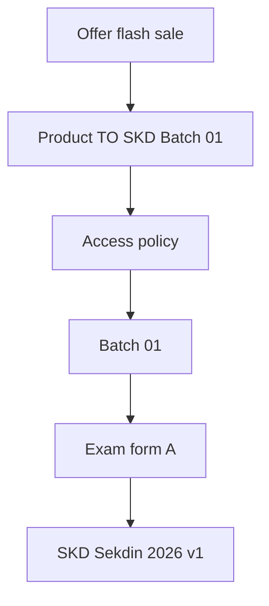

# Spesifikasi Katalog Produk dan Entitlement

**Versi:** 1.0-RC2 — audit-resolved candidate  
**Tanggal:** 28 Agustus 2026  
**Tujuan:** Mendefinisikan cara Superlatif menjual banyak bentuk produk sambil memberi satu pengalaman siswa yang utuh dan dapat dijelaskan.

## 1. Aturan inti

> Product adalah yang dijual Superlatif. Program adalah yang dialami siswa. Entitlement adalah alasan siswa dapat mengakses capability atau resource tertentu.

Ketiganya tidak boleh digabung menjadi satu objek database.

## 2. Glosarium domain

| Istilah | Definisi | Contoh |
|---|---|---|
| Product | Konsep komersial yang stabil | Kelas Akselerasi Kedinasan 2026 |
| Offer | Versi yang dapat dibeli dengan harga, sale window, channel, dan terms tertentu | Early Bird Kelas Akselerasi, Rp199k, 27-30 Agustus |
| External SKU mapping | Penghubung offer internal dengan ID produk Sejoli/WordPress | Sejoli Product ID 1548 |
| Program | Container perjalanan belajar yang dilihat siswa | Program Akselerasi Kedinasan 2026 |
| Track | Jalur atau tahap utama di dalam program | SKD, TPA-TBI, Wawancara |
| Module | Unit belajar berurutan di dalam track | Strategi TIU Numerik |
| Resource | Objek belajar reusable | Video, artikel, PDF, rekaman, link, announcement |
| Live session | Event belajar terjadwal | Live class TIU, 29 Agustus 19.30 WIB |
| Exam family | Keluarga struktur/regulasi ujian | CAT BKN, TKA, SNPMB |
| Blueprint version | Aturan berversi untuk struktur, timer, scoring, dan interpretasi hasil | SKD Sekdin 2026 v1 |
| Exam form | Susunan immutable dari question version yang digunakan | SKD Form A Batch 01 |
| Batch | Event operasional dengan registration, exam, result, review, dan leaderboard window | TO SKD Batch 01 |
| Access policy | Aturan tentang apa yang dapat digunakan, kapan, dan berapa kali | Satu ranked attempt sampai 1 September |
| Access grant | Sumber yang memberi policy kepada siswa dan dapat diaudit | Order SJ-8821 memberikan Batch 01 |
| Effective access | Union hasil resolusi seluruh grant aktif | Alya dapat membuka Batch 01 dari bundle dan promo |

## 3. Mengapa konsep harus dipisahkan

Satu exam form dapat digunakan oleh beberapa batch terkontrol. Satu batch dapat termasuk dalam beberapa product. Satu product dapat memiliki banyak offer. Satu siswa dapat menerima capability yang sama dari beberapa grant.



Mengubah harga flash sale tidak boleh mengubah exam form. Memperbarui blueprint untuk batch masa depan tidak boleh menulis ulang attempt historis.

## 4. Bentuk product

### 4.1 Full program bundle

Contoh: `Kelas Akselerasi Kedinasan 2026`.

Dapat memberi:

- program overview dan onboarding;
- seluruh atau sebagian roadmap track;
- live class terjadwal;
- rekaman dan module;
- batch SKD dan tahap lanjutan tertentu;
- community link;
- akses sampai fixed date atau akhir seleksi.

### 4.2 Specialist program

Contoh: `Paket SKD Intensif`, `Paket TKA`, `Bimbingan Wawancara`.

Memberikan program lebih kecil atau track tertentu. Produk dapat di-upgrade ke program yang lebih lengkap tanpa menyalin konten.

### 4.3 Tryout Pass

Contoh: `Tryout Pass SKD September`.

Memberikan akses berdasarkan aturan koleksi yang eksplisit:

- daftar batch yang sudah ditentukan saat pembelian; atau
- seluruh batch SKD yang memenuhi kriteria dalam periode terbatas.

Aturan harus terlihat oleh siswa. Hindari janji ambigu seperti "semua tryout" tanpa batas waktu dan exam family.

Untuk MVP, Tryout Pass dipresentasikan sebagai **compact program** dengan daftar batch yang terlihat. Implementasi dapat memakai named list atau bounded dynamic collection yang berversi, tetapi siswa selalu melihat batch yang sudah termasuk, batch mendatang yang eligible, dan batas periodenya.

### 4.4 Tryout satuan

Contoh: `TO SKD Batch 01`.

Memberikan satu batch dengan jumlah attempt, result release, review release, dan expiry yang jelas.

### 4.5 Produk content-only atau live-only

Contoh: paket modul, paket rekaman, atau seri live class.

Menggunakan compact program view dan hanya menampilkan tab yang relevan.

### 4.6 Free, scholarship, dan promotional access

Ketiganya bukan pengalaman siswa yang berbeda. Mereka adalah sumber grant untuk capability program yang sama.

## 5. Komposisi product

Product version berisi daftar component/grant, bukan salinan konten.

| Target komponen | Contoh | Opsi policy |
|---|---|---|
| Program | Seluruh Program Akselerasi | Seluruh resource kini dan nanti dalam batas versi |
| Track | SKD saja | Include descendants; exclude track lain |
| Module/resource | Satu panduan wawancara | View/download policy jika perlu |
| Live session series | Seluruh kelas SKD September | Join dan recording policy |
| Live session spesifik | Webinar khusus | Satu event |
| Batch | TO SKD Batch 01 | Attempt, ranking eligibility, review release |
| Batch collection | Empat batch September | Named list atau bounded dynamic rule |
| Community | Grup Akselerasi | Link visibility dan validity |
| Capability | Download, join live, view recording | Digunakan hanya jika operasional memerlukannya |

Product version menjadi immutable setelah dipakai order berbayar. Benefit baru ditambahkan melalui versi baru atau bonus grant eksplisit agar janji historis tetap dapat diaudit.

## 6. Offer model

Offer mengatur presentasi komersial, bukan struktur belajar.

Field minimum:

- offer code dan version internal;
- product version;
- title dan short description;
- current/list price snapshot;
- currency;
- status public, private, invite-only, atau hidden;
- sale start dan end;
- real quota dan sumber sold count jika digunakan;
- eligibility rule;
- hubungan upgrade;
- external checkout URL strategy;
- satu atau lebih Sejoli SKU mapping;
- post-payment return URL;
- terms/version saat pembelian.

### Status offer

- Draft
- Scheduled
- On sale
- Sold out, hanya jika kuota sungguh enforced
- Ended
- Hidden
- Archived

Sale state tidak menentukan student access state.

## 7. Batch model untuk flash-sale tryout

Setiap batch memiliki window operasional terpisah:

| Window | Arti |
|---|---|
| Catalogue visibility | Kapan batch dapat ditemukan |
| Offer sale | Kapan harga promo dapat dibeli |
| Registration/access claim | Kapan user eligible dihubungkan atau claim slot |
| Exam start/end | Kapan ranked attempt dapat berlangsung |
| Late-sync cutoff | Batas pemulihan jawaban sesuai exam contract |
| Provisional result | Kapan hasil sementara tersedia |
| Official result | Kapan hasil final batch dipublish |
| Leaderboard | Kapan ranking terlihat |
| Review/explanation | Kapan kunci dan pembahasan terbuka |
| Access end | Kapan resource non-permanent berakhir |

Contoh ritme mingguan:

| Batch | Penjualan | Pengerjaan | Hasil final |
|---|---|---|---|
| TO SKD Batch 01 | Senin-Selasa | Rabu-Kamis | Jumat |
| TO SKD Batch 02 | Kamis-Jumat | Sabtu-Minggu | Senin |

Ini contoh, bukan jadwal universal yang di-hardcode.

## 8. Access grant model

### 8.1 Sumber grant

- Purchase
- Bundle component
- Upgrade
- Scholarship
- Promotion/bonus
- Manual support grant
- Migration dari sistem legacy
- Ecosystem/free grant untuk resource gratis atau benefit seluruh ekosistem
- Institutional/cohort grant pada fase berikutnya

### 8.2 Lifecycle grant

| Status | Arti |
|---|---|
| Scheduled | Grant valid tetapi start condition belum terpenuhi |
| Active | Saat ini berkontribusi pada effective access |
| Expired | End condition telah lewat |
| Suspended | Ditahan sementara; alasan wajib |
| Revoked | Dicabut permanen dari sumber ini; alasan wajib |
| Cancelled | Tidak pernah aktif karena source order dibatalkan |

Pending payment adalah purchase state, bukan grant aktif. App boleh menampilkan kartu program pending, tetapi capability terlindungi tidak dibuka sebelum status payment memenuhi aturan.

### 8.3 Validity policy

- Fixed start dan fixed end.
- Purchase time ditambah duration.
- First activation ditambah duration.
- Batas lifecycle program atau batch.
- Lifetime/tanpa end otomatis.
- Manual start/end.

Setiap policy menyimpan timezone dan definisi batas waktu. Tanggal siswa menggunakan Asia/Jakarta kecuali program menentukan zona lain.

### 8.4 Attempt policy

Hak attempt dipisahkan dari visibilitas konten:

- maximum ranked attempts;
- maximum practice attempts;
- apakah resume diizinkan;
- apakah retake membutuhkan grant baru;
- attempt open/end window;
- accommodation extension;
- ranking eligibility;
- cooldown jika diperlukan.

Siswa dapat memiliki beberapa attempt untuk satu batch tanpa membuat kartu program duplikat.

Keputusan MVP:

- ranked attempt dan practice attempt memiliki penghitung terpisah;
- practice attempt diset `0` dan tidak memiliki UI pada MVP;
- eligibility leaderboard serta attempt yang dihitung ditentukan oleh batch, bukan default product atau blueprint;
- ranked batch menggunakan immutable exam form/fixed question set; tidak ada pool randomization;
- option shuffle hanya diperbolehkan jika blueprint menyatakannya aman dan order yang disajikan disimpan pada attempt;
- exam form yang kunci atau pembahasannya sudah dirilis tidak boleh dipakai untuk ranked batch baru.

Kosakata machine-readable attempt allowance:

| Field/nilai | Arti kanonik |
|---|---|
| `mode=inherit_batch` | Product tidak menambah allowance; resolver mengikuti attempt policy batch. |
| `mode=per_batch` | Product/grant membawa allowance per batch yang tetap tunduk pada batas dan ranking rule batch. |
| `rankingRuleSource=batch` | Attempt yang dihitung untuk ranking selalu ditentukan batch. |
| `maxPracticeAttempts=0` | Practice attempt tidak tersedia pada MVP. |

### 8.5 Post-expiry policy

Setiap product version wajib memilih perilaku setelah akses berakhir:

- `hide_all`: program dan konten tidak lagi terlihat selain bukti transaksi;
- `read_only_history`: kartu, progres, serta hasil historis tetap terlihat; resource terlindungi tidak dapat dibuka;
- `retain_selected_resources`: hanya target yang ditandai tetap dapat dibuka;
- `retain_results_only`: attempt dan hasil tetap terlihat tanpa pembahasan atau materi.

Default MVP adalah `read_only_history`. Janji yang lebih luas, seperti rekaman sampai akhir program atau lifetime, hanya berlaku jika ada di versi product/offer yang dibeli dan tercatat pada register janji legacy.

## 9. Resolusi effective access

Untuk satu siswa, target, action, dan waktu `t`:

1. Temukan grant ke target langsung atau ancestor yang mencakup target.
2. Pertahankan grant dengan start condition terpenuhi.
3. Keluarkan grant expired, cancelled, suspended, atau revoked.
4. Evaluasi attempt limit dan batch window.
5. Gabungkan grant dengan capability valid paling permisif, kecuali safety/legal rule mengharuskan sebaliknya.
6. Kembalikan keputusan dan alasan yang mudah dipahami.

Contoh:

```text
Dapat membuka SKD Module 03: YA
Alasan 1: Pembelian Kelas Akselerasi 2026, valid sampai 31 Desember 2026
Alasan 2: Grant Beasiswa SKD, lifetime
```

Mencabut Alasan 1 tidak menghapus akses karena Alasan 2 tetap aktif.

### Bentuk keputusan akses yang wajib tersedia

- allowed atau denied;
- target dan action;
- grant aktif yang mendukung;
- next start time jika scheduled;
- effective end time jika finite;
- attempt used/remaining jika relevan;
- denial reason yang aman ditampilkan ke siswa;
- diagnostic reason internal untuk support.

## 10. Aturan stacking dan deduplication

### E1 - Union, bukan overwrite

Akses baru menambah akses valid yang ada, bukan mengganti seluruh subscription siswa.

### E2 - Satu resource di UI

Jika dua grant menunjuk resource version yang sama, tampilkan satu kali. Support tetap dapat melihat semua sumber.

### E3 - Expiry independen

Setiap grant berakhir sendiri. Effective access baru berakhir ketika tidak ada grant aktif yang mendukung.

`expiryResolution=latest_supporting_grant` berarti effective end adalah akhir terjauh dari grant aktif yang masih mendukung target/action tersebut; nilai ini tidak memperpanjang source grant yang sudah berakhir.

### E3A - Resolusi allowance attempt

`attemptResolution` memiliki tiga nilai kanonik:

- `sum_distinct_sources`: jumlah allowance dari source grant berbeda yang lolos deduplikasi;
- `maximum_allowance`: gunakan allowance tertinggi dari seluruh source pendukung;
- `batch_policy_only`: product/grant tidak menambah allowance dan batch menjadi satu-satunya pemilik batas.

Default ranked MVP adalah `batch_policy_only`, kecuali product version secara eksplisit dan setelah validasi publish memilih strategi lain. Deduplikasi menggunakan `dedupeKey` yang hanya boleh tersusun dari `source`, `target`, `action`, dan `policy_version`; kombinasi identik tidak dihitung dua kali.

### E4 - Refund hanya memengaruhi grant dari sumber order tersebut

Refund atau chargeback mencabut grant yang berasal dari order itu. Scholarship, manual, migration, dan purchase lain tidak ikut terhapus.

Attempt yang sudah selesai, result version, serta ranking snapshot tetap disimpan sebagai catatan historis setelah refund. Hak membuka pembahasan, rekaman, atau resource lain mengikuti effective grant yang tersisa. Nama tampil pada leaderboard tetap tunduk pada opt-in; posisi snapshot tidak dihapus diam-diam, tetapi dapat disembunyikan dari publik karena permintaan privasi tanpa mengubah skor historis.

### E5 - Upgrade adalah tambahan yang dapat diaudit

Upgrade memberi perbedaan benefit atau product version baru. Purchase lama tetap menjadi sejarah. Jika akses lama harus disupersede, hubungan itu eksplisit dan reversible.

### E6 - Duplicate purchase tidak membuat duplicate UI

Order tetap direkam. Siswa melihat satu program dan hasil validity yang benar. Jika duplicate purchase tidak boleh, blokir sebelum checkout dengan pesan jelas.

### E7 - Bonus harus eksplisit

Bonus promo menjadi grant terpisah dengan validity dan source campaign, bukan mutasi tersembunyi pada base product.

### E8 - Perubahan manual memerlukan alasan

Grant, extension, suspension, dan revocation manual merekam actor, reason, timestamp, target, dan before/after policy.

## 11. Integrasi commerce dengan Sejoli

### 11.1 Mapping

Gunakan many-to-one mapping dari external SKU ke internal offer. Ini mendukung:

- ID Sejoli legacy dan baru;
- beberapa harga/campaign untuk product yang sama;
- upgrade SKU;
- pemulihan dari duplicate catalogue entry.

Mapping harus berversi. Order menyimpan mapping, product version, dan offer version yang berlaku saat transaksi.

### 11.2 Purchase projection state

String kanonik status commerce adalah:

- `pending`
- `paid`
- `failed`
- `expired`
- `cancelled`
- `refunded_partial`, hanya jika benar-benar didukung provider
- `refunded_full`
- `chargeback`, jika tersedia

UI boleh menerjemahkannya menjadi label Indonesia yang lebih manusiawi, tetapi adapter, database, event normalization, dan test fixture memakai string kanonik di atas.

Raw payload dan transition yang dinormalisasi disimpan untuk audit.

### 11.3 Alur pemrosesan

1. Verifikasi keaslian event menggunakan mekanisme yang benar-benar didukung Sejoli.
2. Simpan event eksternal secara idempotent.
3. Resolve user dengan aman; jangan hanya bergantung pada email jika ada stable external ID.
4. Resolve external SKU mapping version.
5. Buat/perbarui purchase projection.
6. Buat atau cabut source-derived grant sesuai transition rule.
7. Hitung ulang effective access projection.
8. Kirim notifikasi setelah access state committed.
9. Masukkan event gagal/ambigu ke reconciliation queue.

Nama webhook, signature, dan identifier final membutuhkan spike payload Sejoli nyata sebelum Gate 3.

## 12. Contoh kasus

### Contoh A - Kelas Akselerasi plus tryout satuan

Alya memiliki:

- Kelas Akselerasi yang memberi Batch 01-04;
- promo grant untuk Batch 05;
- purchase Batch 02 yang dibeli lebih dulu.

App menampilkan satu Program Akselerasi, Batch 02 satu kali, dan Batch 05 sebagai bonus aktif. Support tetap dapat melihat semua alasan akses.

### Contoh B - Paket SKD upgrade ke bundle penuh

Raka memiliki Paket SKD sampai 30 September, kemudian membeli upgrade Kelas Akselerasi sampai 31 Desember.

App mempertahankan history SKD, menambahkan track baru, tidak menggandakan konten SKD, dan menghitung validity setiap resource dari kedua grant.

### Contoh C - Refund dengan scholarship overlap

Sinta membeli Paket TKA dan menerima scholarship untuk satu diagnostic batch. Purchase kemudian di-refund.

App mencabut konten dari purchase tetapi mempertahankan diagnostic batch dari scholarship.

### Contoh D - Tryout Pass dengan future batch

Tryout Pass September menjanjikan semua batch SKD yang exam window-nya dimulai 1-30 September.

Collection rule harus berversi dan dibatasi. Saat batch eligible dipublish, child grant dibuat dan diaudit. Batch Oktober tidak termasuk kecuali offer menyatakannya.

## 13. Status akses yang dilihat siswa

Gunakan bahasa sederhana:

- Aktif - lanjutkan belajar
- Dimulai [tanggal]
- Pembayaran menunggu - selesaikan atau cek pembayaran
- Ujian dibuka [tanggal]
- Hasil tersedia [tanggal]
- Akses berakhir [tanggal]
- Perlu upgrade
- Akses sedang diperiksa - tampilkan referensi support jika terlambat

Jangan tampilkan istilah internal seperti entitlement, grant resolver, webhook, atau SKU.

## 14. Kontrol dan safeguard admin

### Product Builder

- Membuat product dan immutable version.
- Menautkan program, track, resource, live series, batch, atau collection rule.
- Preview effective access dari pembelian baru.
- Warning jika product kosong, validity hilang, atau inclusion circular.

### Offer Builder

- Mengatur sale window, visibility, price snapshot, eligibility, dan real quota.
- Mapping satu atau lebih Sejoli SKU.
- Preview state siswa sebelum, selama, dan setelah sale.

### Entitlement Manager

- Search berdasarkan siswa, order, external ID, program, atau batch.
- Menampilkan access timeline dan sumber pendukung.
- Simulasi revoke/expiry sebelum commit.
- Grant, extend, suspend, atau revoke sesuai permission dan reason.
- Tidak mengedit database secara langsung dari support workflow.

### Reconciliation Queue

- Unknown SKU
- User tidak dapat di-resolve
- Invalid state transition
- Duplicate external-user candidate
- Paid order tanpa grant
- Active grant tanpa source yang memenuhi
- Refund/chargeback yang membutuhkan review

## 15. Conceptual data model untuk Gate 3

Nama final dapat berubah, tetapi ERD minimal harus mewakili:

- products dan product_versions;
- offers dan external_sku_mappings;
- purchases dan purchase_events;
- programs, program_versions, tracks, modules, resources, dan assets;
- live_sessions dan schedule_items;
- access_policies, access_grants, grant_claims, dan effective_access projection;
- exam_families, blueprint_versions, exam_forms, batches, dan attempt_policies;
- user_attempts dan operational exceptions;
- import_jobs, import_rows/issues, question_versions, dan moderation decisions.

## 16. Invariant untuk kontrak implementasi

1. Setiap effective access dapat dijelaskan oleh minimal satu grant aktif.
2. Menghapus satu grant tidak boleh menghapus akses yang didukung grant aktif lain.
3. Completed purchase menyimpan product dan offer version saat pembelian.
4. Exam form yang sudah digunakan immutable; koreksi membuat version baru.
5. Sale window dan exam window independen.
6. Attempt right tidak disimpulkan dari content visibility.
7. Replay event commerce tidak membuat duplicate grant.
8. Unknown SKU atau ambiguous user mapping tidak memberi akses luas secara diam-diam.
9. Manual mutation diaudit dan dibatasi permission.
10. Siswa melihat satu canonical program/resource walaupun sumber grant lebih dari satu.
11. Ranked form tidak memilih soal secara acak per attempt dan tidak digunakan kembali setelah review/kunci dirilis.
12. Practice attempt tidak tersedia pada MVP walaupun kontrak data menyiapkan penghitung terpisah.
13. Expiry dan refund tidak menghapus attempt, result version, atau ranking snapshot historis.
14. Product gratis tetap menghasilkan grant yang dapat dijelaskan; resource gratis tidak dibuka melalui bypass authorization.

## 17. Keputusan yang dibutuhkan sebelum Gate 3

- Validity setiap produk aktif 2026.
- Start rule setiap produk: payment, fixed date, atau first activation.
- Refund/cancellation event yang tersedia dari Sejoli.
- Stable user identifier dari WordPress/Sejoli.
- Tryout Pass memakai named batches atau bounded dynamic rule.
- Track Kelas Akselerasi yang benar-benar dijanjikan secara komersial.
- Upgrade pricing/eligibility sebagai commerce policy, bukan hardcode entitlement.
- Apakah lifetime benar-benar dibutuhkan atau sebenarnya sampai seleksi selesai.

## 18. Acceptance scenario untuk automated test

- Replay event paid dua kali menghasilkan satu transition dan tanpa duplicate grant.
- Bundle dan paket spesialis overlap; expiry salah satunya tetap mempertahankan shared access dari yang lain.
- Refunded order hanya mencabut grant miliknya.
- Manual scholarship tetap aktif setelah purchase refund.
- Siswa dengan dua attempt dapat mulai dua kali dan attempt ketiga ditolak jelas.
- Offer berakhir tetapi exam window siswa yang sudah bayar tetap terbuka.
- Hasil rilis sebelum pembahasan; result diizinkan dan kunci tetap terkunci.
- Unknown external SKU masuk reconciliation dan tidak memberi akses.
- Extension support mengubah policy terpilih, mencatat actor/reason, dan reversible.
- Batch baru masuk September Pass tetapi tidak masuk August Pass.
