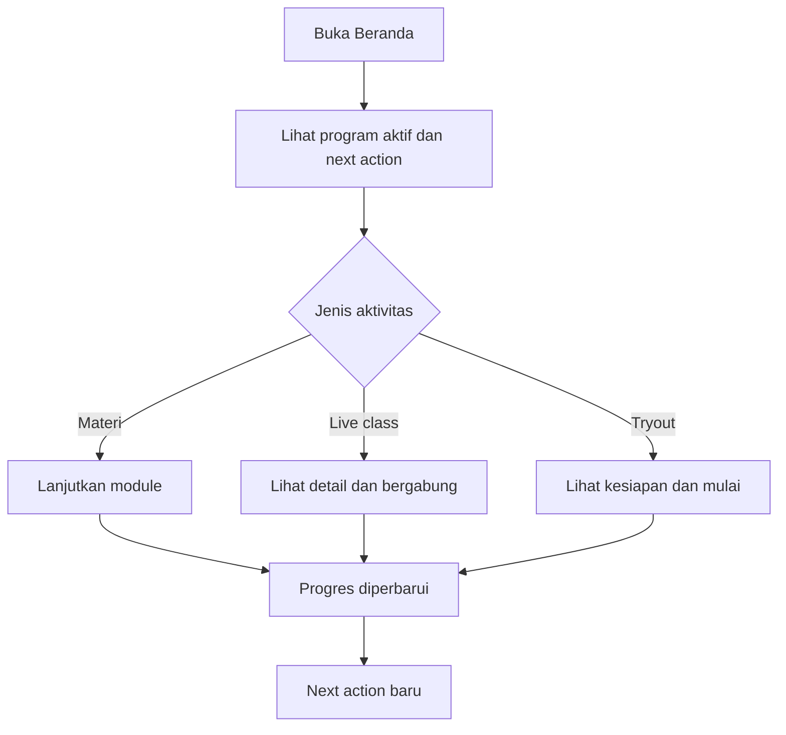
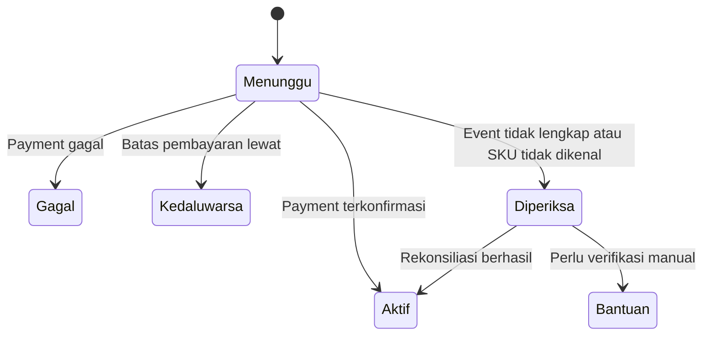
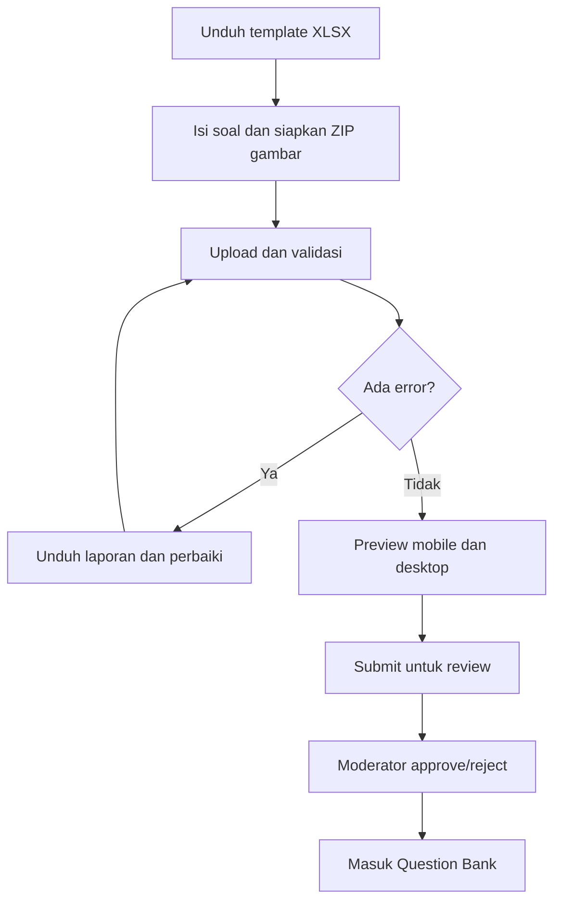

# User Journeys

**Versi:** 1.0-RC2 — audit-resolved candidate  
**Tanggal:** 28 Agustus 2026  
**Tergantung pada:** Gate 1 PF-001 sampai PF-021

## 1. Tujuan dokumen

Dokumen ini memetakan perjalanan end-to-end siswa dan tim operasional. Fokusnya bukan daftar halaman, melainkan perubahan keadaan pengguna: dari belum memiliki akses, menjadi aktif, belajar, mengikuti tryout, memahami hasil, lalu melanjutkan perjalanan.

## 2. Prinsip journey

1. Setiap journey harus memiliki satu next action yang jelas.
2. Siswa tidak perlu memahami perbedaan WordPress, Sejoli, webhook, dan web app.
3. Program menjadi konteks utama; fitur menjadi fasilitas di dalam program.
4. Status pembelian, akses, jadwal, attempt, hasil, dan pembahasan tidak boleh disamakan.
5. Saat gagal, sistem menjelaskan apa yang terjadi, apa yang tetap aman, dan tindakan berikutnya.
6. Mindset-first diterapkan melalui clarity, interpretation, dan recovery, bukan dekorasi motivasi.

## 3. Journey A - Pembeli baru Kelas Akselerasi

**Persona:** Alya  
**Outcome:** Selesai membeli, akses aktif, onboarding selesai, dan menjalankan aktivitas bermakna pertama.

| Tahap | Tujuan siswa | Aksi/touchpoint | Risiko/emosi | Respons UX | Event utama |
|---|---|---|---|---|---|
| Menemukan | Memahami manfaat dan kecocokan | Landing page WordPress | Ragu program terlalu berat atau tidak sesuai | Copy menjelaskan journey, fasilitas, jadwal, dan siapa yang cocok | `product_viewed` |
| Memilih | Mengetahui isi paket | Offer detail | Bingung track mana yang termasuk | Ringkasan benefit dan masa akses eksplisit | `offer_viewed` |
| Checkout | Membayar dengan aman | Checkout Sejoli | Takut payment gagal/duplikat | Prefill aman, branding konsisten, status pembayaran jelas | `checkout_started` |
| Menunggu | Mengetahui apakah pembayaran berhasil | Return page + status di app | Cemas akses belum muncul | State `Pembayaran sedang diperiksa`; auto-poll/reconciliation; reference support | `payment_pending_viewed` |
| Aktivasi | Masuk tanpa registrasi kedua | Magic link/SSO | Lupa password atau merasa diarahkan ke sistem lain | Satu identitas, return URL ke program | `access_activated` |
| Onboarding | Memahami program dan jadwal | Program onboarding | Overwhelmed oleh banyak tahap | Maksimal 3 langkah: tujuan, aturan penting, next action | `program_onboarding_completed` |
| First value | Mulai aktivitas pertama | Beranda/program hub | Tidak tahu harus mulai dari mana | Satu CTA `Lanjutkan persiapan awal` | `first_meaningful_action` |

### Acceptance journey

- Tidak ada form registrasi kedua setelah pembayaran.
- Program tampil maksimal beberapa menit setelah payment success; exception memiliki status dan reference.
- Onboarding tidak meminta data yang sudah dimiliki.
- Siswa dapat mencapai aktivitas pertama dalam maksimal dua aksi dari Beranda.

## 4. Journey B - Siswa lama pertama kali masuk web app baru

**Persona:** Siswa aktif yang sebelumnya memakai WordPress Member Area  
**Outcome:** Identitas dan produk lama terhubung tanpa kehilangan akses atau progres penting.

| Tahap | Kondisi | Respons sistem | Edge case penting |
|---|---|---|---|
| Handoff | Login di WordPress lalu klik `Masuk Platform Belajar` | SSO ke app dengan akun terhubung | Email berubah atau satu email memiliki lebih dari satu kandidat |
| Resolve | App mencari produk aktif hasil migrasi | Menampilkan ringkasan akses yang ditemukan | SKU legacy tidak dikenal masuk reconciliation, bukan diabaikan |
| Konfirmasi | Siswa melihat program aktif | `Kami menemukan 2 program milikmu` | Produk overlap ditampilkan sebagai satu program dengan benefit gabungan |
| Orientasi | UI baru dikenalkan | Tour maksimal 3 poin dan dapat dilewati | Jangan memaksa tour setiap login |
| Lanjut | Sistem memilih next action | Aktivitas terbaru atau roadmap awal | Progres lama yang tidak dapat dimigrasikan diberi penjelasan jujur |

### Aturan migrasi UX

- Jangan meminta siswa memilih akun jika mapping stabil sudah tersedia.
- Jika kandidat ambigu, akses tidak digabung otomatis; minta verifikasi aman.
- Riwayat transaksi tidak harus menjadi syarat untuk menggunakan program jika active grant sudah terverifikasi.
- Jangan menjanjikan migrasi progres yang tidak tersedia.

## 5. Journey C - Penggunaan harian siswa program aktif

**Persona:** Alya  
**Outcome:** Menyelesaikan satu aktivitas paling relevan dan memahami apa berikutnya.

### Urutan prioritas next action

Journey ini memakai satu resolver otoritatif di `09_UX_SPECIFICATION.md §5`; dokumen journey tidak membuat urutan kedua. Setiap rekomendasi membawa `reason_code`, deadline/server time, dan tie-break yang sama pada Beranda maupun Program Hub.

Promo tidak boleh mengalahkan aktivitas belajar yang mendesak.

### Momen mindset

- Sebelum mulai: jelaskan mengapa aktivitas ini relevan.
- Setelah selesai: akui progres secara spesifik.
- Setelah skor rendah: arahkan ke tindakan perbaikan yang realistis.
- Setelah absen: tawarkan jalur kembali tanpa rasa bersalah.

## 6. Journey D - Membeli dan mengikuti flash-sale tryout

**Persona:** Raka  
**Outcome:** Membeli offer yang masih valid, memahami semua window, menyelesaikan ranked attempt, dan melihat hasil.

| Tahap | Informasi wajib | CTA utama | State alternatif |
|---|---|---|---|
| Discover | Family, batch, sale end, exam window, harga | `Lihat detail` | Scheduled, sold out nyata, ended |
| Detail | Attempt, peserta/ranking policy, result/review release | `Beli via Sejoli` | Sudah punya, tidak eligible, pending |
| Return | Status payment dan akses | `Buka batch` | Sedang diperiksa, gagal, expired |
| Sebelum ujian | Device check, aturan, durasi, window | `Mulai tryout` | Belum buka, attempt habis, lewat batas |
| Ujian | Timer, autosave, navigasi, status sinkronisasi | `Tinjau jawaban` | Offline, resume, takeover |
| Submit | Ringkasan terjawab/kosong | `Kirim jawaban` | Unsynced queue, timeout |
| Hasil sementara | Skor yang memang tersedia dan label sementara | `Lihat yang perlu diperbaiki` | Menunggu official result |
| Hasil final | Skor, status, peringkat jika berlaku, insight | `Lanjutkan perbaikan` | Correction version, review belum buka |
| Pembahasan | Kunci dan pembahasan setelah waktunya | `Pelajari pembahasan` | Belum dirilis |

### Aturan copy waktu

Waktu operasional disimpan UTC dan dihitung oleh server. UI merender zona akun pengguna serta menampilkan label WIB sebagai zona otoritatif jika batch/seleksi nasional menetapkannya. Sale window tidak pernah disamakan dengan exam window.

Gunakan label eksplisit:

- Promo berakhir
- Tryout dibuka
- Batas mulai
- Batas selesai
- Hasil final tersedia
- Pembahasan tersedia

Jangan memakai satu label `Berakhir` untuk semua konteks.

## 7. Journey E - Siswa dengan beberapa produk

**Persona:** Alya/Raka setelah upgrade  
**Outcome:** Melihat program yang berbeda tanpa resource duplikat atau kehilangan konteks.

### Contoh kepemilikan

- Kelas Akselerasi Kedinasan 2026.
- Paket SKD lama.
- Bonus TO SKD Batch 05.
- Bimbingan Wawancara.

### Perilaku UI

- Beranda memilih `program utama` berdasarkan aktivitas terbaru, jadwal terdekat, atau pilihan siswa.
- Program lain muncul setelah section utama, bukan sejajar dengan CTA belajar utama.
- Resource yang sama tampil sekali di canonical program context.
- Badge menjelaskan `Termasuk Kelas Akselerasi`, `Bonus`, atau `Dibeli terpisah` hanya saat membantu keputusan.
- Program utama dapat diganti dari Program Saya tanpa mengubah entitlement.

### Edge case

- Jika dua program mempunyai jadwal bersamaan, Jadwal global menampilkan keduanya dan memberi warning konflik.
- Jika produk lama expired tetapi bundle masih aktif, resource tetap dapat dibuka tanpa flash `expired`.
- Jika upgrade pending, akses lama tetap aktif sesuai grant-nya.

## 8. Journey F - Payment pending atau akses belum muncul

**Outcome:** Siswa memahami status dan tidak melakukan pembelian ganda karena panik.

### UX minimum

- Tampilkan nama offer, nominal snapshot, waktu transaksi, dan reference.
- Nonaktifkan pembelian ulang offer yang sama selama pending yang masih valid.
- Sediakan `Cek lagi` tanpa membuat transaksi baru.
- Hubungi support dengan reference yang sudah terisi.
- Jangan menampilkan error teknis webhook kepada siswa.

## 9. Journey G - Akses berakhir dan upgrade

**Outcome:** Siswa memahami apa yang berakhir, apa yang tetap dimiliki, dan pilihan lanjutannya.

| Waktu | Pengalaman |
|---|---|
| H-7 | Notice halus di program; tidak menutupi next action |
| H-1 | Reminder yang jelas jika ada pekerjaan penting |
| Saat berakhir | Program berubah menjadi read-only summary jika policy mengizinkan; protected resource terkunci |
| Setelah berakhir | Riwayat hasil tetap terlihat sesuai retention policy |
| Upgrade tersedia | Tampilkan perbedaan benefit, harga melalui Sejoli, dan akses yang sudah dimiliki |

Tidak boleh ada dark pattern seperti menghapus progres atau menyembunyikan tanggal berakhir.

## 10. Journey H - TKA elective onboarding (fase ekspansi)

**Outcome:** Siswa memilih dua mapel yang valid sebelum konten dan tryout dibuka.

1. Buka Program TKA setelah access active.
2. Sistem menjelaskan mapel wajib dan jumlah mapel pilihan.
3. Siswa memilih dari daftar yang memang tersedia untuk cohort/aturan tersebut.
4. Sistem menampilkan preview konten yang akan terbuka.
5. Siswa mengonfirmasi.
6. Perubahan setelah konfirmasi mengikuti policy yang dijelaskan; tidak diam-diam mereset progres.

Jika pilihan tidak lengkap, next action adalah menyelesaikan setup, bukan memulai tryout yang salah.

## 11. Journey I - Admin meluncurkan program dan offer

**Persona:** Nisa  
**Outcome:** Program, benefit, offer Sejoli, dan state siswa siap tanpa perubahan kode.

| Tahap | Aksi admin | Safeguard |
|---|---|---|
| Struktur | Buat program version, track, module, resource | Preview hierarchy; deteksi track kosong |
| Jadwal | Tambahkan live session dan recording policy | Timezone eksplisit; conflict warning |
| Product | Pilih komponen/grant | Effective-access preview |
| Offer | Atur harga snapshot, sale window, eligibility | Server-time preview; real quota only |
| Mapping | Hubungkan satu atau lebih SKU Sejoli | Duplicate/unknown mapping warning |
| Uji | Gunakan test user | Tidak tercampur data produksi |
| Publish | Publish program/offer | Checklist dan permission gate |
| Pantau | Lihat purchase/access exception | Reconciliation queue dan audit |

## 12. Journey J - Bulk import dan publikasi soal

**Persona:** Dimas dan Maya  
**Outcome:** Banyak soal masuk dengan cepat tanpa melewati kontrol kualitas.

### Aturan pengalaman

- Upload tidak langsung publish.
- Error menunjuk sheet, row, question code, field, dan rekomendasi perbaikan.
- Soal valid dapat disimpan sebagai draft meski row lain gagal, tetapi admin harus memilih perilaku ini secara eksplisit.
- Preview memeriksa teks, opsi, gambar, formula, stimulus, dan pembahasan.
- Re-upload dengan question code sama memiliki pilihan `perbarui draft` atau `buat revision`; tidak silent overwrite.

## 13. Journey analytics minimum

| Journey | Funnel minimum |
|---|---|
| Pembelian program | `offer_viewed -> checkout_started -> payment_success -> access_activated -> onboarding_completed -> first_meaningful_action` |
| Belajar harian | `home_viewed -> next_action_opened -> activity_completed -> next_action_generated` |
| Live class | `schedule_viewed -> live_detail_viewed -> join_clicked -> attendance_confirmed -> recording_viewed` |
| Tryout | `batch_viewed -> attempt_started -> attempt_resumed? -> attempt_submitted -> result_viewed -> remediation_started` |
| Import soal | `import_started -> validation_completed -> preview_opened -> review_submitted -> questions_approved` |
| Support akses | `access_issue_detected -> reconciliation_started -> access_resolved -> student_notified` |

## 14. Journey acceptance untuk Gate 2

- Setiap journey mempunyai start state, success state, dan recovery state.
- Tidak ada journey siswa yang memerlukan pengetahuan tentang arsitektur internal.
- Program tetap menjadi konteks pada materi, jadwal, dan tryout.
- Pengguna multi-product tidak melihat duplikasi resource.
- Payment pending, access pending, exam scheduled, dan result pending memiliki copy berbeda.
- Journeys admin memerlukan preview, permission, dan audit untuk tindakan berisiko.
