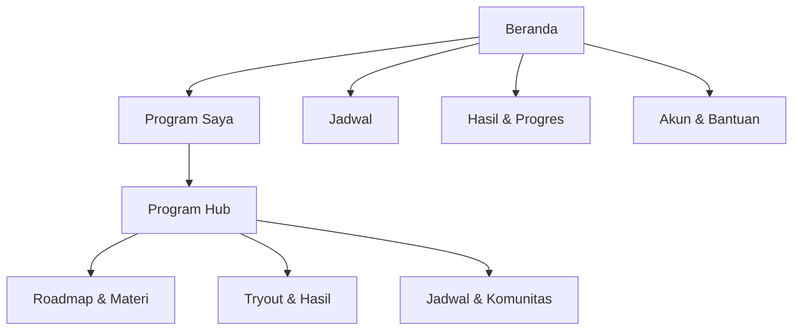

# Information Architecture dan Sitemap

**Versi:** 1.0-RC2 — audit-resolved candidate  
**Tanggal:** 28 Agustus 2026

## 1. Prinsip arsitektur informasi

1. Program adalah pusat organisasi konten siswa.
2. Navigasi global hanya memuat tujuan yang berlaku lintas program.
3. Tryout, materi, rekaman, live class, dan komunitas berada di dalam program; shortcut global tetap mempertahankan konteks program.
4. Katalog dan kepemilikan dipisahkan secara visual tetapi tetap berada di Program Saya.
5. Halaman hanya menampilkan tab/section yang relevan dengan benefit siswa.
6. Admin IA mengikuti pekerjaan operasional, bukan struktur tabel database.

## 2. Navigasi siswa

### Desktop

| Urutan | Label | Tujuan |
|---:|---|---|
| 1 | Beranda | Next action, program utama, jadwal terdekat, roadmap, aktivitas |
| 2 | Program Saya | Semua program dimiliki, status akses, dan katalog relevan |
| 3 | Jadwal | Kalender lintas program dan detail kegiatan |
| 4 | Hasil & Progres | Hasil ujian, progres program, dan rekomendasi |
| 5 | Bantuan | FAQ kontekstual, status insiden, dan kontak support |
| 6 | Akun | Profil, notifikasi, device/session, privasi |

### Mobile bottom navigation

| Label | Isi |
|---|---|
| Beranda | Sama dengan desktop, diprioritaskan untuk next action |
| Program | Program aktif dan katalog |
| Jadwal | Agenda hari ini dan kalender |
| Progres | Hasil dan progres |
| Akun | Profil, bantuan, notifikasi, device |

`Bantuan` tersedia dari Akun dan context-help di layar purchase, program, dan exam.

## 3. Sitemap siswa



### Route yang direkomendasikan

```text
/home
/programs
/programs/:programSlug
/programs/:programSlug/roadmap
/programs/:programSlug/schedule
/programs/:programSlug/materials
/programs/:programSlug/materials/:resourceId
/programs/:programSlug/tryouts
/programs/:programSlug/tryouts/:batchSlug
/programs/:programSlug/progress
/programs/:programSlug/community
/schedule
/progress
/progress/attempts/:attemptId
/catalog/offers/:offerSlug
/purchases/:purchaseId/status
/help
/account
/account/notifications
/account/devices
/account/privacy
```

Route final dapat berubah pada Gate 3, tetapi hierarchy dan konteks tidak boleh hilang.

`/programs/:programSlug/tryouts/:batchSlug` adalah canonical student batch route. Deep link global boleh memakai `/batches/:batchId`, tetapi server harus me-resolve satu program context yang dimiliki siswa atau meminta pilihan program; ia tidak boleh membuat dunia tryout terpisah.

## 4. Struktur Beranda

Urutan section:

1. **Program utama dan next action**
   - Nama program.
   - Periode/status akses.
   - Progress summary.
   - Satu aktivitas prioritas.
   - CTA `Lanjutkan belajar`, `Gabung kelas`, atau `Mulai tryout`.
2. **Jadwal terdekat**
   - Maksimal tiga item paling relevan.
   - CTA `Lihat kalender`.
3. **Perjalanan menuju tujuan**
   - Roadmap stage dengan status saat ini.
4. **Aktivitas terbaru**
   - Rekaman, materi, hasil, atau announcement baru.
5. **Program lain yang dimiliki**
   - Hanya jika ada lebih dari satu program.
6. **Rekomendasi offer**
   - Paling bawah dan hanya jika relevan.

Jika ada live class yang berlangsung, banner kontekstual dapat muncul di atas section pertama tanpa mengganti keseluruhan halaman.

## 5. Struktur Program Saya

### Tab/segmen

- **Aktif:** program yang dapat digunakan sekarang.
- **Akan dimulai:** grant scheduled.
- **Menunggu pembayaran:** purchase pending.
- **Selesai/berakhir:** history dan akses tersisa.
- **Jelajahi program:** offer yang relevan dan tidak duplikat.

### Urutan kartu aktif

1. Program utama pilihan siswa.
2. Program dengan jadwal terdekat.
3. Program dengan aktivitas terbaru.
4. Sisanya berdasarkan terakhir digunakan.

Kartu menampilkan tujuan, status akses, next action, dan satu progress summary. Jangan menampilkan seluruh daftar fasilitas di kartu.

## 6. Struktur Program Hub

### Header program

- Nama dan cohort/tahun.
- Status akses dan masa berlaku.
- Progress ringkas.
- Next action.
- Link ke bantuan khusus program.

### Tab kontekstual

| Tab | Tampil jika | Isi |
|---|---|---|
| Ringkasan | Selalu | Next action, jadwal, roadmap ringkas, update |
| Roadmap | Program memiliki track/module | Stage, module, prerequisite, status |
| Jadwal | Ada schedule item | Live class, tryout, deadline, office hour |
| Tryout | Ada batch/attempt | Available, scheduled, completed, result |
| Materi & Rekaman | Ada resource | Video, article, PDF, recording, link |
| Komunitas | Ada community entitlement | Channel/group link dan aturan |
| Progres | Ada progress/result | Learning completion dan exam trends |

Tidak ada tab kosong. Jika hanya satu fasilitas, Program Hub dapat memakai section tanpa tab.

## 7. Hierarchy konten belajar

```text
Program
  Track
    Roadmap stage
      Module
        Resource
          Video | Artikel | PDF/File | Rekaman | Link | Pengumuman
```

Aturan:

- Track merepresentasikan jalur nyata, bukan sekadar subject.
- Module dapat berisi beberapa resource.
- Resource dapat digunakan ulang, tetapi progress context mengikuti program/module.
- Prerequisite hanya digunakan jika benar-benar penting; jangan mengunci materi secara berlebihan.
- Resource baru tidak otomatis menjadi wajib untuk siswa lama tanpa product/program policy.

## 8. Jadwal global dan jadwal program

### Jadwal global

Menggabungkan seluruh program yang dimiliki siswa:

- agenda hari ini;
- upcoming 7/30 hari;
- calendar month;
- filter program dan jenis aktivitas;
- conflict warning;
- timezone Asia/Jakarta.

### Jadwal program

Hanya menampilkan aktivitas program tersebut dan mempertahankan breadcrumb/context.

Jenis schedule item:

- live class;
- office hour/mentoring;
- tryout window;
- result/review release;
- assignment/deadline;
- announcement event.

## 9. Hasil & Progres

### Global progress

- Ringkasan program aktif.
- Attempt terbaru lintas program.
- Rekomendasi perbaikan.
- Trend hanya jika data cukup.

### Program progress

- Roadmap completion.
- Aktivitas bermakna selesai.
- Attendance/recording status jika relevan.
- Hasil tryout program.

### Attempt detail

- Blueprint/family label.
- Status provisional/final/corrected.
- Skor per section/subtest.
- Passing status hanya jika berlaku.
- Percentile/rank hanya jika policy batch mendukung.
- Topic insight.
- Pembahasan sesuai review release.

## 10. IA katalog dan checkout

Katalog tidak menjadi toko besar yang mengganggu pembelajaran.

### Entry point

- `Jelajahi program` di Program Saya.
- Rekomendasi kontekstual setelah hasil atau di bagian bawah Beranda.
- Deep link dari landing page WordPress.

### Offer detail

- Tujuan dan siapa yang cocok.
- Benefit yang benar-benar termasuk.
- Waktu akses.
- Jadwal penting.
- Existing access comparison.
- Harga dan sale window.
- CTA checkout Sejoli.

Jika siswa sudah memiliki seluruh benefit, tampilkan `Sudah termasuk programmu`, bukan CTA beli.

## 11. IA admin

### Navigasi utama admin

Nama dan route pada bagian ini adalah kanonik untuk seluruh screen specification. Role `Live-Class Coordinator` memiliki akses terbatas ke Jadwal & Live Class, occurrence, recording, attendance, serta komunikasi operasional; ia tidak memiliki akses ke kunci soal, scoring, purchase mentah, atau grant keuangan.

| Area | Route menu kanonik | Submenu/objek |
|---|---|---|
| Ringkasan | `/admin` | Operasional hari ini, exception, publish schedule |
| Produk & Penawaran | `/admin/catalog/products` | Product, product version, offer, SKU mapping |
| Program & Kurikulum | `/admin/programs` | Program, track, stage, module, enrollment |
| Konten | `/admin/content/resources` | Resource, version, asset, announcement |
| Bank Soal | `/admin/questions` | Question, stimulus, media asset, review queue, report soal |
| Import Soal | `/admin/questions/imports` | Import job, validation issue, preview, history |
| Ujian & Blueprint | `/admin/exams/blueprints` | Exam family, blueprint, scoring policy, form |
| Batch Tryout | `/admin/exams/batches` | Batch, window, attempt policy, result release |
| Jadwal & Live Class | `/admin/schedule` | Schedule, live session, occurrence, recording, attendance |
| Live Ops | `/admin/live-ops` | Active batch, session health, incident action |
| Akses & Rekonsiliasi | `/admin/access` | Purchase, grant, effective access, reconciliation |
| Pengguna | `/admin/users` | Student lookup, role, support history terbatas |
| Hasil & Koreksi | `/admin/results/corrections` | Result version, impact preview, correction approval |
| Notifikasi | `/admin/notifications` | Template, audience, schedule, delivery, suppression |
| Laporan | `/admin/analytics` | Activation, learning, tryout, conversion |
| Sistem | `/admin/settings` | Role/permission, audit, integration status, config version |

### Route konseptual admin

```text
/admin
/admin/catalog/products
/admin/catalog/offers
/admin/programs
/admin/programs/:id/builder
/admin/content/resources
/admin/schedule
/admin/questions
/admin/questions/imports
/admin/questions/review
/admin/exams/blueprints
/admin/exams/forms
/admin/exams/batches
/admin/exams/batches/:id/live
/admin/live-ops
/admin/access
/admin/purchases/reconciliation
/admin/users
/admin/users/:id
/admin/results/corrections
/admin/notifications
/admin/analytics
/admin/settings
/admin/settings/roles
/admin/audit
```

Route koleksi di atas menjadi target navigasi. Route `/:id` adalah detail/builder dari koleksi yang sama dan bukan area navigasi baru.

## 12. Permission-based navigation

| Area | Super Admin | Operations Admin | Academic Admin | Tutor/Writer | Moderator/Reviewer | Live-Class Coordinator | Support | Finance/Reconciliation |
|---|---:|---:|---:|---:|---:|---:|---:|---:|
| Produk/offer | Kelola | Kelola | Lihat | — | — | — | Lihat aman | Lihat harga/transaksi |
| Program/konten | Kelola | Kelola | Kelola/publish | Buat draft | Review akademik | Lihat jadwal terkait | Lihat aman | — |
| Jadwal/live | Kelola | Kelola | Kelola | Lihat/join | Lihat | Kelola occurrence/recording | Lihat | — |
| Bank soal | Kelola | Lihat metadata | Kelola/second approval | Buat/import draft | Review/approve | — | — | — |
| Blueprint/form/batch | Kelola | Kelola batch non-akademik | Kelola/publish | Lihat | Review | Live status | Observasi/eskalasi | — |
| Akses/entitlement | Kelola | Kelola sesuai policy | Lihat | — | — | — | Cari/eskalasi | Lihat sumber transaksi |
| Rekonsiliasi | Kelola | Kelola | Lihat | — | — | — | Buat case | Kelola |
| Live Ops | Kelola | Action sesuai izin | Action akademik sesuai izin | — | Observasi | Action live-class sesuai izin | Observasi/eskalasi | — |
| Role/settings | Kelola | — | — | — | — | — | — | — |

Role dapat digabung pada satu pengguna, tetapi permission berisiko tinggi tetap mengikuti separation of duties. Penulis tidak dapat menyetujui versinya sendiri; second approval ranked dilakukan Moderator/Reviewer dan Academic Admin oleh dua aktor berbeda.

Detail authorization menjadi kontrak Gate 3. Navigasi tidak boleh menjadi satu-satunya kontrol keamanan.

## 13. Breadcrumb dan context switching

- Student app memakai breadcrumb hanya pada hierarchy dalam: `Program > Track > Module > Resource`.
- Mobile menggunakan back link dengan nama parent, bukan breadcrumb panjang.
- Admin selalu menggunakan breadcrumb untuk builder dan detail.
- Mengganti program dari header tidak membuang unsaved progress.
- Context switch saat exam berlangsung tidak diizinkan; exam runner masuk mode fokus.

## 14. Search dan filter

### MVP siswa

- Search tidak wajib di Beranda.
- Search materi hanya jika satu program memiliki konten cukup banyak.
- Filter Program Saya berdasarkan status.
- Filter Jadwal berdasarkan program dan jenis.

### MVP admin

- Global lookup user/order/reference.
- Search question code/content.
- Filter question family, subject, topic, status, author, reviewer, dan import job.
- Search program/resource.

Jangan menambahkan filter yang tidak memiliki volume data nyata.

## 15. Empty-state routing

| Kondisi | Pesan | CTA |
|---|---|---|
| Tidak punya program | Jelaskan manfaat memiliki ruang belajar terstruktur | `Jelajahi program` |
| Punya program, belum ada next action | Program siap; jadwal atau materi akan segera diperbarui | `Lihat roadmap` atau bantuan |
| Tidak ada jadwal | Tidak ada agenda dekat | `Lihat roadmap` |
| Belum pernah tryout | Jelaskan apa yang akan diukur | `Lihat tryout tersedia` |
| Belum ada hasil | Hasil muncul setelah attempt selesai | `Mulai tryout` jika eligible |
| Tidak ada program lain | Section disembunyikan, bukan empty card |
| Admin import kosong | Jelaskan format XLSX/ZIP | `Unduh template` |

## 16. Metadata dan SEO

- App private dan halaman akun diberi `noindex`.
- Landing page dan katalog SEO utama tetap di WordPress.
- Deep link app memakai canonical internal route dan tidak menggandakan marketing content.
- Page title membantu orientasi: `Roadmap - Kelas Akselerasi | Superlatif`.

## 17. Acceptance IA

- Lima item mobile bottom navigation cukup untuk seluruh aktivitas siswa.
- Tryout dan Live Class tidak menjadi silo global tanpa konteks program.
- Semua route sensitif memiliki ownership/access check.
- Empty tab tidak ditampilkan.
- Multi-product ownership tidak menimbulkan resource duplikat.
- Admin dapat menemukan product, program, question, batch, purchase, dan user dalam maksimal dua tingkat navigasi utama.
