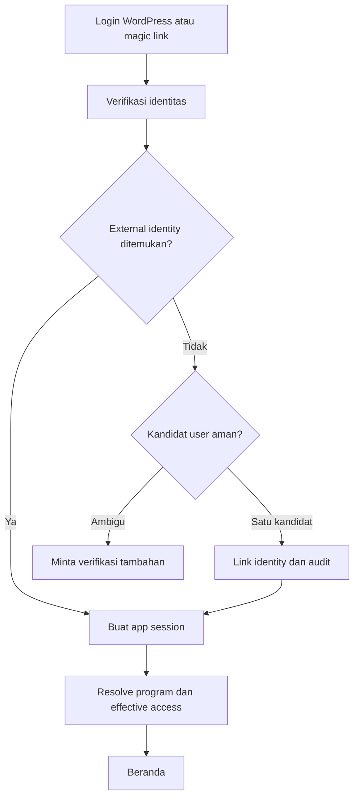
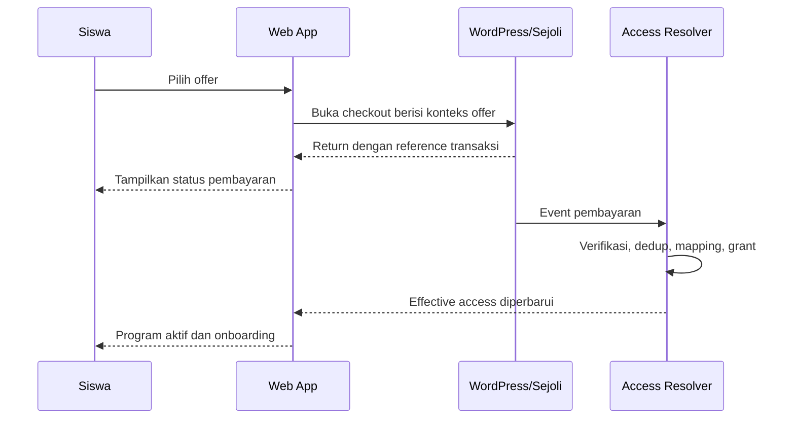
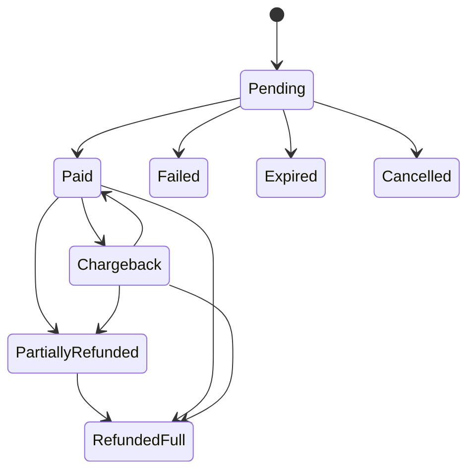
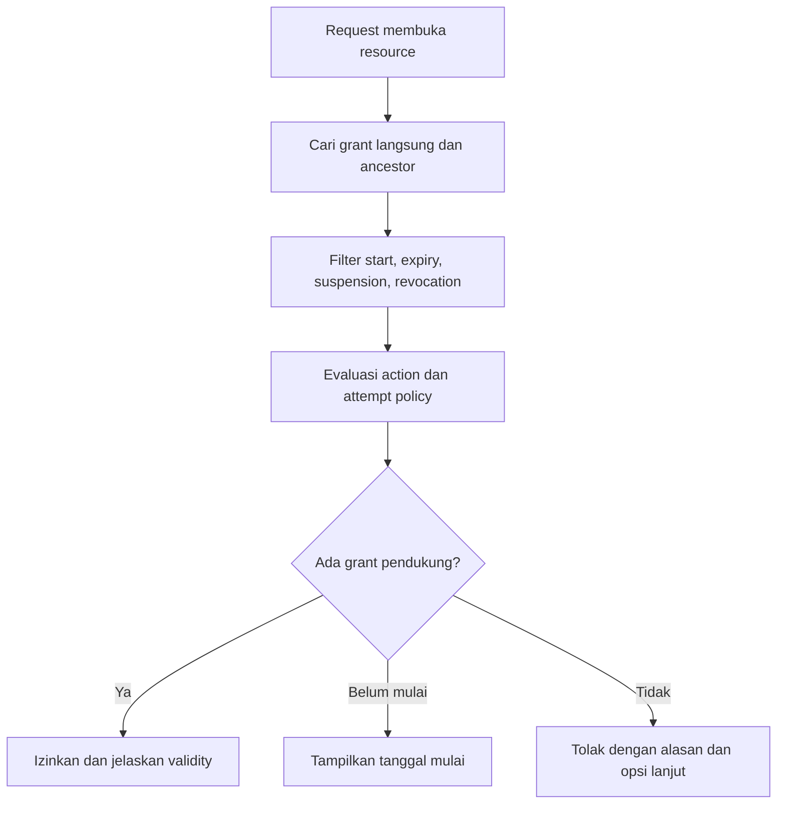
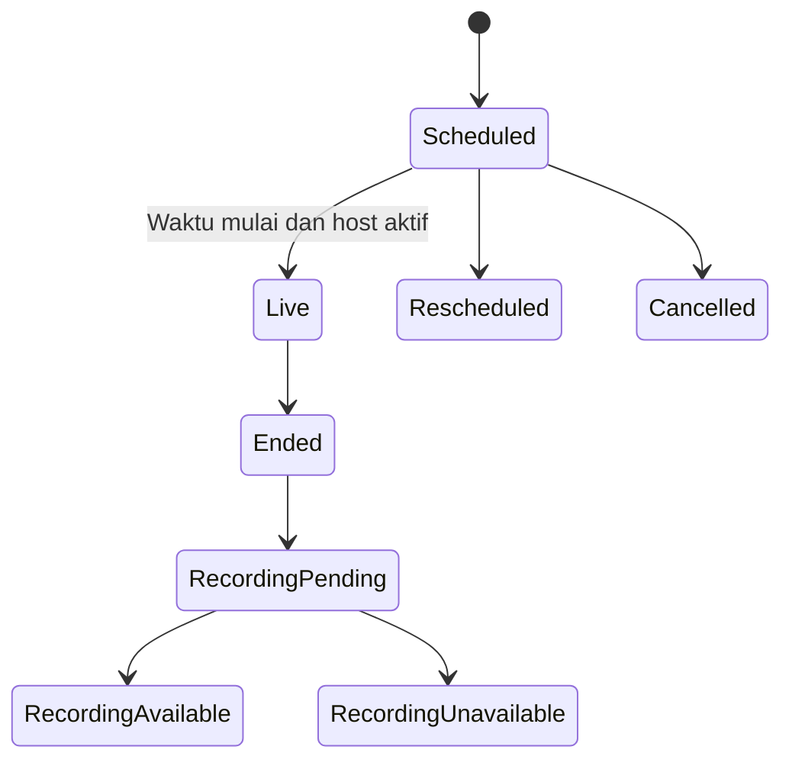
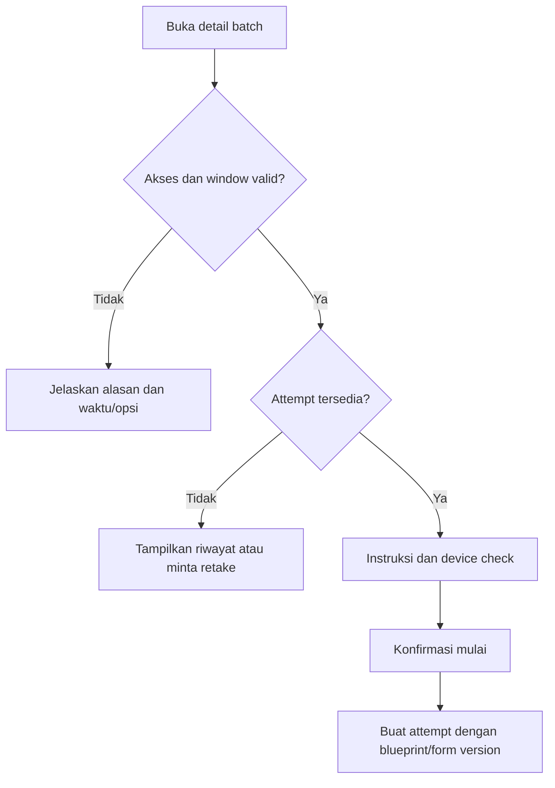
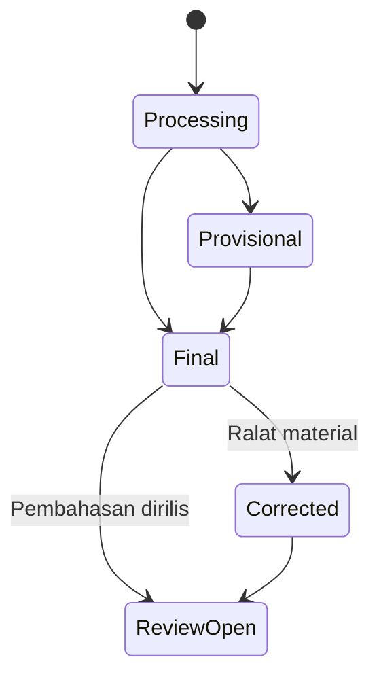
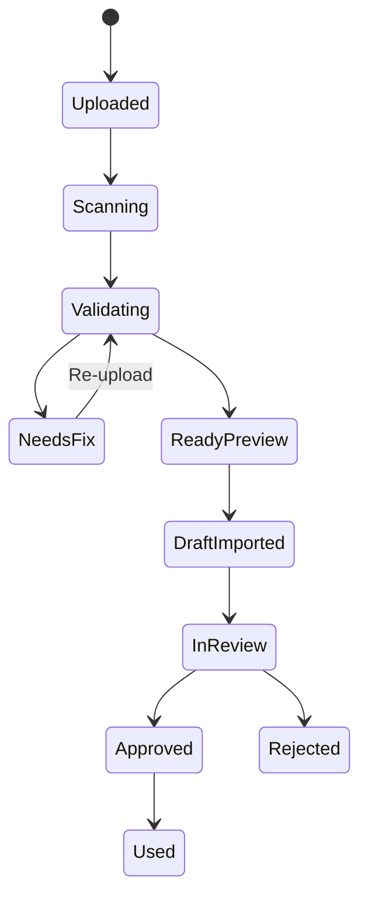
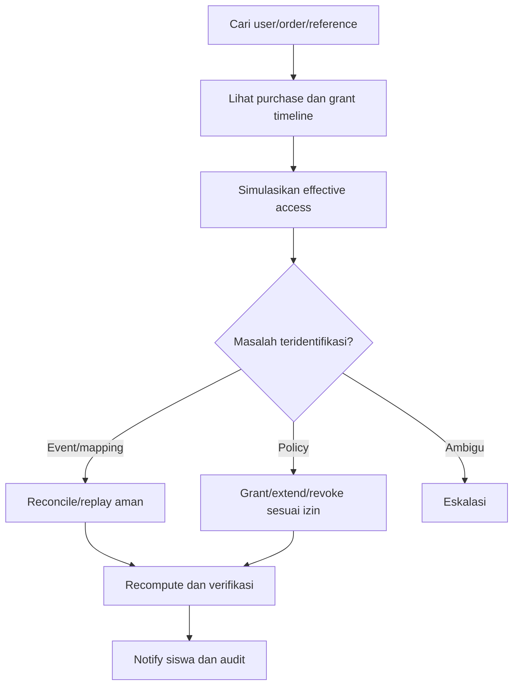

# User Flows dan Edge Cases

**Versi:** 1.0-RC2 — audit-resolved candidate  
**Tanggal:** 28 Agustus 2026

## 1. Konvensi

- **Student state** adalah keadaan yang dilihat siswa.
- **System state** adalah keadaan domain/internal.
- **Recovery** adalah jalur aman yang tersedia setelah kegagalan.
- Flow tidak menentukan endpoint atau nama tabel; kontrak teknis dibuat di Gate 3.

## 2. Flow login dan account linking

### Edge cases

| Kondisi | Perilaku | Dilarang |
|---|---|---|
| Token expired | Tawarkan ulang login/SSO dan pertahankan intended destination | Menampilkan raw token error |
| Email berubah | Gunakan stable external ID; minta verifikasi jika mismatch material | Menggabungkan akun hanya karena nama sama |
| Dua kandidat user | Hentikan auto-link dan eskalasi verifikasi | Memilih kandidat pertama |
| Account suspended | Jelaskan akses akun dibatasi dan jalur bantuan | Menghapus data lokal tanpa penjelasan |
| App session habis saat belajar | Refresh session di background jika aman | Menghilangkan progress draft |
| Session habis saat ujian | Exam recovery contract berlaku; jangan redirect mendadak ke login | Membuang antrean jawaban |

## 3. Flow pembelian, payment, dan access activation

### State purchase

State domain kanonik untuk tiga state terakhir adalah `refunded_partial`, `refunded_full`, dan `chargeback`; nama CamelCase pada diagram hanya label visual Mermaid.

### Edge cases commerce

| Kondisi | Student UX | Operasional |
|---|---|---|
| Return page terbuka sebelum webhook | `Pembayaran sedang diperiksa` + auto-check | Poll/reconciliation, bukan duplicate invoice |
| Webhook dikirim ulang | Tidak ada perubahan visual ganda | Dedup idempotent |
| Unknown SKU | `Akses sedang diperiksa` | Masuk reconciliation; grant tidak dibuat |
| User tidak ditemukan | Tampilkan reference dan estimasi pemeriksaan | Resolve dengan stable ID/email terverifikasi |
| Payment sukses, grant gagal | Jangan menyuruh beli ulang | Alert P0 operasional; retry aman |
| Dua pending order offer sama | Tampilkan keduanya hanya jika nyata; CTA mengarah ke order yang masih valid | Prevent accidental duplicate checkout |
| Refund sebagian tidak didukung | Jangan menampilkan state palsu | Manual review |
| Offer selesai setelah checkout dimulai | Honor invoice valid sesuai terms atau tolak jelas berdasarkan policy | Tidak mengubah harga setelah payment |

## 4. Flow effective access dan overlapping grant

### Edge cases akses

| Kondisi | Hasil |
|---|---|
| Paket SKD expired, bundle masih aktif | Resource SKD tetap terbuka dari bundle |
| Refund bundle, scholarship batch aktif | Batch scholarship tetap terbuka |
| Manual grant dan purchase overlap | Tampilkan resource sekali; support melihat dua sumber |
| Grant scheduled | Program tampil di `Akan dimulai`; protected content terkunci sampai waktu mulai |
| Resource dihapus dari program version baru | Historical product promise tetap mengikuti version yang dibeli |
| Access resolver tidak tersedia | Fail closed untuk resource baru; jangan memutus exam yang sudah sah tanpa recovery contract |
| Admin revoke luas | Wajib impact preview, reason, permission, dan audit |

## 5. Flow onboarding program

1. Effective access pertama kali aktif.
2. Buka Program Hub atau deep link onboarding.
3. Tampilkan maksimal tiga langkah yang benar-benar diperlukan:
   - tujuan/cohort dan periode;
   - aturan penting/jadwal;
   - setup khusus seperti elective choice jika ada.
4. Tampilkan preview next action.
5. Siswa mengonfirmasi dan masuk Program Hub.

### Edge cases

- Onboarding sudah selesai di device lain: jangan ulangi.
- Setup optional dilewati: jangan memblokir program.
- Setup wajib belum lengkap: blokir hanya capability yang membutuhkan setup.
- Program tidak mempunyai materi pertama: arahkan ke jadwal/announcement, bukan halaman kosong.
- Student masuk dari notifikasi live class: izinkan join flow cepat lalu minta onboarding setelah kelas.

## 6. Flow next action

### Resolver priority

`09_UX_SPECIFICATION.md §5` adalah satu-satunya source of truth untuk prioritas, threshold, reason code, dan tie-break resolver. Flow ini hanya mengatur respons ketika kandidat resolver dipilih.

### Edge cases

| Kondisi | Perilaku |
|---|---|
| Dua aktivitas sama penting | Pilih deadline paling dekat; tampilkan yang kedua di Jadwal |
| Aktivitas selesai di tab lain | Refresh state dan ganti CTA tanpa hard reload |
| Resource sementara gagal dimuat | Tawarkan retry dan alternatif activity jika ada |
| Program paused/suspended | Jangan memberi CTA ke protected resource; jelaskan status |
| Tidak ada next action | Tampilkan roadmap overview atau jadwal berikutnya, bukan misi palsu |

## 7. Flow live class

### Student flow

1. Beranda/Jadwal menampilkan kelas terdekat.
2. Detail menampilkan topik, tutor, waktu, provider, aturan, dan material pendamping.
3. Join button aktif sesuai join window.
4. Click membuka provider eksternal dengan fallback copy link.
5. Attendance dikonfirmasi dari integration atau aturan operasional yang tersedia.
6. Setelah kelas, recording dan material muncul sesuai policy.

### Edge cases

- Host terlambat: status `Belum dimulai oleh tutor`, auto-refresh terbatas.
- Link provider invalid: tampilkan fallback support dan incident reference.
- Reschedule: tanggal lama tetap terlihat sebagai `Dijadwalkan ulang`; notifikasi hanya ke peserta eligible.
- Cancelled: jangan hilangkan event dari history; jelaskan pengganti/refund policy jika relevan.
- Student membuka setelah selesai: arahkan ke recording state.
- Dua program memakai sesi yang sama: jadwal global menampilkan satu canonical event dengan dua context badges jika perlu.

## 8. Flow materi dan progres

1. Siswa membuka module dari Roadmap atau next action.
2. Resource dibuka dengan program/module context.
3. Progress disimpan secara bertahap.
4. Completion mengikuti aturan resource, bukan hanya click.
5. Setelah selesai, next action diperbarui.

### Completion rule awal

| Resource | Default MVP | Catatan |
|---|---|---|
| Artikel | Tombol `Tandai selesai` setelah content dibuka | Jangan menebak pemahaman dari scroll |
| PDF/file | Tombol `Tandai selesai`; download tidak otomatis selesai | Preview atau open external tersedia |
| Video | Watched threshold ringan atau tombol selesai sesuai policy | Hindari anti-skip yang menghukum playback wajar |
| Rekaman | Sama dengan video tetapi optional by default | Kehadiran live dapat memenuhi activity jika policy mengizinkan |
| External link | Return confirmation atau manual complete | Jangan mengandalkan third-party tracking yang tidak tersedia |

### Edge cases

- Progress lokal lebih baru dari server: gunakan conflict policy transparan dan jangan menurunkan completion tanpa alasan.
- Resource revision: patch minor mempertahankan progress; revision material dapat meminta revisit tanpa menghapus history.
- Video provider blocked: berikan fallback link atau material alternatif.
- Resource expired saat sedang dibuka: izinkan graceful finish jika policy mengizinkan; jangan memotong tiba-tiba.

## 9. Flow batch dan attempt tryout

### Pre-start

### In-exam state

- Loading initial payload.
- Ready.
- Saving.
- Saved.
- Offline - tersimpan di perangkat.
- Syncing.
- Conflict/recovery.
- Time warning.
- Review.
- Submitting.
- Submitted.

### Exam edge cases

| Kondisi | UX wajib | Data rule arah |
|---|---|---|
| Internet putus | Banner non-modal; jawaban tetap dapat dipilih; antrean lokal terlihat | Idempotent queue |
| Refresh/crash | Resume ke state server + antrean lokal yang sah | Merge sesuai Exam Contract v2 |
| Device lain membuka attempt | Jelaskan sesi aktif dan takeover; jangan silent kick | Single active UI session |
| Timer server berbeda | Koreksi halus; warning hanya jika material | Server-authoritative |
| Gambar gagal | Retry asset dan report; jangan tampilkan soal yang tidak dapat dijawab tanpa incident policy | Protected CDN/fallback |
| Waktu habis saat offline | Lock input, sync antrean sesuai cutoff, tampilkan status | Cutoff configurable |
| Submit dengan unsynced answers | Tunggu sinkronisasi maksimal 30 detik; jika belum selesai, submit jawaban server yang sah dan terbitkan recovery receipt/reference | Kandidat late-sync disimpan, tidak otomatis dinilai |
| Double tap submit | Satu hasil idempotent | Duplicate request aman |
| App background karena WA masuk | Tidak auto-submit atau menambah pelanggaran | Telemetry pasif bila perlu |
| Accessibility accommodation | Timer/window mengikuti attempt-specific policy | Audited grant |

## 10. Flow hasil, correction, dan pembahasan

### Aturan UI

- `Provisional` wajib memiliki label dan penjelasan tentang bagian yang belum final.
- `Final` menampilkan calculation/version timestamp.
- `Corrected` menampilkan apa yang berubah dan kapan, tanpa menyalahkan siswa.
- Passing status hanya tampil untuk blueprint yang benar-benar memiliki aturan tersebut.
- SNBT/TKA estimate wajib memakai label `Skor simulasi Superlatif`.
- Answer key tidak muncul sebelum review release.
- Kandidat jawaban yang tiba dalam 30 detik setelah deadline menempatkan hasil pada state `withheld/manual review` bila dapat berdampak; adjudikasi membuat result version baru dan tidak menimpa hasil lama.

### Edge cases

- Scoring terlambat: tampilkan processing dan estimasi yang jujur jika tersedia.
- Ranking belum siap: hasil personal dapat tampil tanpa ranking.
- Question correction mengubah skor: notify affected user sesuai threshold/policy.
- Attempt dibatalkan admin: history dan alasan terlihat, retake grant ditawarkan jika berlaku.
- User anonim/deleted: ranking menggunakan display aman sesuai privacy policy.

## 11. Flow bulk import soal

### Import state

### Validasi minimum

- Workbook/template version.
- Sheet dan kolom wajib.
- Question code unik dalam file dan workspace.
- Question type valid.
- Option lengkap.
- Correct answer/bobot sesuai tipe.
- Stimulus reference valid.
- Image reference ditemukan di ZIP.
- Extension, size, dan mime asset aman.
- Formula dapat diparse atau ditandai untuk review.
- Subject/topic tersedia.
- Explanation policy terpenuhi.

### Edge cases

- ZIP berisi file tidak direferensikan: warning, bukan selalu error.
- Dua filename hanya berbeda kapital: error untuk menghindari perbedaan filesystem.
- Satu gambar dipakai beberapa soal: simpan satu asset canonical.
- Workbook 1.000+ soal: proses async dengan progress dan dapat ditinggal.
- Import sebagian: pilihan eksplisit `hanya simpan row valid sebagai draft`; default tidak.
- Job gagal internal: retry tidak menggandakan question draft.
- Question code sudah publish: jangan overwrite; minta revision workflow.
- Retry byte-identik memakai import key yang sama; kode lama hanya boleh `update_draft` atau `create_revision` sesuai `15A_QUESTION_IMPORT_TEMPLATE_CONTRACT.md`.

## 12. Flow koreksi soal setelah digunakan

1. Report atau item analysis menandai soal.
2. Moderator membuka history, question version, dan event usage.
3. Tentukan `patch minor` atau `revision material`.
4. Jika material, hitung affected attempts dan score impact sebelum publish.
5. Approver kedua diperlukan untuk perubahan kunci pada ranked batch.
6. Publish correction version.
7. Re-score secara idempotent.
8. Buat result/snapshot version baru.
9. Notify user terdampak sesuai policy.
10. Simpan audit lengkap.

### Incident: void batch dan retake massal

1. Incident commander menahan result/ranking release dan memilih severity.
2. Sistem menampilkan jumlah attempt serta dampak sebelum tindakan.
3. `Void batch` memindahkan attempt ke `voided` dengan reason; data tidak dihapus.
4. Retake diberikan sebagai grant/allowance baru yang idempotent untuk populasi terdampak.
5. Notifikasi menggunakan template incident yang disetujui dan reference yang sama.
6. Semua tindakan memerlukan permission, reason, second approval untuk ranked batch, dan audit before/after.

## 13. Flow admin access support

### Safeguard

- Support umum tidak dapat melihat answer key.
- Broad grant/revoke membutuhkan role lebih tinggi.
- Impact preview menampilkan target dan expiry sebelum commit.
- Tidak ada tombol `fix all` tanpa scoped selection.
- Replay event tidak membuat grant duplikat.

## 14. Global UI failure states

| Failure | Perilaku |
|---|---|
| API timeout | Pertahankan data terakhir yang aman, retry scoped, tampilkan timestamp |
| Partial page failure | Section error, bukan seluruh halaman jika independen |
| Maintenance terjadwal | Notice sebelum waktu; exam aktif memiliki policy khusus |
| Incident aktif | Banner status dengan waktu update dan reference |
| Unauthorized | Kembali ke login sambil mempertahankan intended route |
| Forbidden | Jelaskan akses tidak tersedia; jangan menyamarkan sebagai 404 jika siswa perlu tahu |
| Not found | Tawarkan kembali ke program context |
| Stale client version | Minta refresh aman di luar exam; selama exam gunakan compatibility/recovery policy |

## 15. Acceptance flow Gate 2

- Semua flow penting memiliki loading, success, empty, error, dan recovery state.
- Attempt, purchase, access grant, batch, result, dan review menggunakan state terpisah.
- Tidak ada retry yang berpotensi menggandakan payment, grant, question, atau submission.
- Interupsi mobile normal tidak dihukum sebagai kecurangan.
- Tindakan admin berisiko memiliki permission, impact preview, reason, dan audit.
- Copy siswa tidak menampilkan istilah teknis internal.
