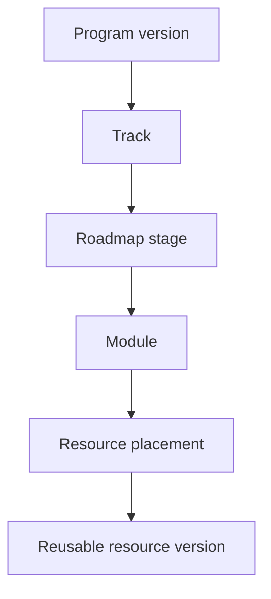

# 14 — Program, LMS, dan Live Class Specification

**Versi:** 1.0-RC2  
**Status:** Audit-resolved candidate  
**Scope produksi awal:** Kelas Akselerasi Kedinasan 2026

## 1. Tujuan

Mendefinisikan domain dan lifecycle pengalaman belajar di luar exam runner: program, roadmap, materi, jadwal, live class, rekaman, progres, onboarding, komunitas eksternal, dan next action.

## 2. Invariant domain

1. Program adalah container pengalaman siswa; product hanya memberikan akses.
2. Struktur dipublikasikan sebagai version; perubahan historis dapat ditelusuri.
3. Resource reusable memiliki satu identity dan banyak placement.
4. Progress menempel pada placement/version yang dialami siswa, bukan judul bebas.
5. Aktivitas optional tidak menurunkan persentase required progress.
6. Schedule selalu menyimpan timezone.
7. Join link dan recording mengikuti effective access saat diminta.
8. Reschedule/cancel tidak menghapus event lama dari audit.

## 3. Model program



### Program

- Stable identity, slug, category, audience, owner.
- Version: title, description, period, onboarding schema, publish state.
- Satu program boleh memiliki beberapa version, hanya satu active version per enrollment policy.

### Track

Jalur besar seperti SKD, TPA–TBI, administrasi, kesehatan/kebugaran, wawancara, dan tahap akhir.

### Roadmap stage

- ordered position;
- required/optional;
- release rule;
- prerequisite expression sederhana;
- target date opsional;
- completion rule.

### Module

Kelompok aktivitas belajar. Module dapat reusable hanya jika semantic-nya benar; placement tetap program-specific.

### Resource dan placement

Resource menyimpan konten reusable. Placement menyimpan urutan, label lokal, required flag, release, dan completion rule.

## 4. Resource types

| Tipe | Konten minimum | Completion |
|---|---|---|
| Article | sanitized rich text | explicit atau reached-end event |
| PDF/File | asset reference, download policy | open + optional explicit complete |
| Video | provider/asset, duration, caption | threshold configurable, default 90% |
| Recording | live session reference/video | sama seperti video |
| External link | allowlisted URL, warning | explicit return/complete |
| Exercise | internal/external activity | completion callback/manual |
| Announcement | message, severity, validity | read acknowledgement opsional |
| Community link | private external URL | tidak dihitung sebagai progress |

Video watch threshold tidak menjadi anti-skip punishment. Admin dapat memilih manual completion untuk materi yang tidak dapat diukur.

## 5. Lifecycle content

`Draft → In review → Approved → Scheduled/Published → Archived`

- Edit sebelum publish memperbarui draft.
- Edit resource yang sudah dipakai menghasilkan version baru.
- Minor metadata non-learning seperti typo label dapat memakai controlled amendment dengan audit.
- Asset lama tidak dihapus selama masih direferensikan version historis.

## 6. Release rules MVP

- Immediate.
- Fixed datetime.
- Relative to enrollment/activation.
- Setelah prerequisite placement/stage selesai.
- Manual release oleh admin.

Rules lebih kompleks memakai AND terbatas. Circular dependency ditolak saat publish.

## 7. Enrollment dan program version

Enrollment tercipta ketika effective access memberi program/track. Enrollment tidak menjadi sumber akses.

Field minimum:

- user, program, program version;
- enrolled_at dan source reason;
- onboarding status;
- preferred/primary flag;
- archived/completed state;
- last activity.

Jika program version baru dipublish:

- enrollment aktif tidak dipindah diam-diam;
- admin memilih `keep`, `migrate with mapping`, atau `new cohorts only`;
- mapping stage/module/resource mempertahankan completion yang semantic-nya sama.

## 8. Onboarding

Schema onboarding berversi dan mendukung:

- profile confirmation;
- timezone;
- target/institution;
- baseline/self-assessment;
- elective choice, misalnya dua mapel TKA;
- notification preference;
- community consent.

Jawaban dapat disimpan sebagian. Perubahan pilihan yang memengaruhi akses/roadmap memerlukan policy dan konfirmasi.

## 9. Progress model

### Unit progress

- `not_started`
- `in_progress`
- `completed`
- `waived` dengan reason
- `reset` hanya melalui controlled action

Data:

- first_started_at;
- last_activity_at;
- completed_at;
- position_seconds/page bila relevan;
- completion source;
- resource version;
- last event sequence.

### Aggregation

```text
required_progress = completed_or_waived_required / released_required
```

Aktivitas belum dirilis tidak masuk denominator. Optional progress dilaporkan terpisah. Projection dapat dibangun ulang dari unit progress dan curriculum placement.

## 10. Next-action resolver

Input:

- effective access;
- program priority/user choice;
- live schedule;
- active attempt;
- deadline;
- roadmap release/prerequisite;
- result remediation;
- progress.

Priority:

1. live now;
2. deadline <24 jam;
3. active attempt;
4. live/batch <24 jam;
5. next required roadmap item;
6. remediation;
7. optional item.

Output:

- action type dan target;
- program/track context;
- reason code dan human copy key;
- start/deadline/duration;
- progress/resume state;
- generated_at dan projection version.

Resolver tidak menyimpan copy final; UI melakukan localization dari reason code.

## 11. Schedule domain

### Schedule item

- program/track reference;
- type: live_class, exam_window, deadline, announcement, other;
- title/description;
- starts_at, ends_at, timezone;
- visibility/access rule;
- status;
- source object/version.

### Live session

- provider dan external meeting ID;
- host/tutor;
- join window;
- attendee capacity hanya bila nyata;
- recording policy;
- reminder schedule;
- current occurrence dan reschedule lineage.

### Status

`draft`, `scheduled`, `live`, `ended`, `cancelled`, `rescheduled`.

## 12. Join flow

1. User membuka live session.
2. App mengevaluasi effective access.
3. App mengevaluasi join window dan session status.
4. App menerbitkan redirect/join response berumur pendek.
5. Event `live_class_joined` dicatat tanpa menyimpan credential provider.

Private meeting URL tidak ditanam permanen di HTML/analytics. Jika provider tidak mendukung tokenized join, endpoint app tetap melakukan gated redirect.

## 13. Reschedule dan cancellation

- Reschedule membuat revision/occurrence baru dan menautkan yang lama.
- User melihat waktu lama dan baru.
- Notification job memakai audience snapshot berbasis access saat pengiriman.
- Cancellation reason wajib; pengganti opsional.
- Jadwal lama tidak hilang dari audit dan calendar sync.

## 14. Recording

- Recording dapat berasal dari provider atau upload asset.
- Processing state: pending, processing, ready, failed, archived.
- Recording ditempatkan sebagai resource dan dapat memiliki release delay.
- Access mengikuti grant saat playback, bukan hanya saat link dibuat.
- Caption/transcript metadata disediakan bila tersedia.

## 15. Komunitas eksternal

MVP menyimpan:

- provider/name;
- gated redirect URL;
- membership instructions;
- validity dan audience;
- consent/read acknowledgement.

Web app tidak mengelola message history komunitas.

## 16. Admin builder

### Program Builder

- stable program dan version;
- tree track/stage/module/placement;
- drag/reorder dengan collision checks;
- required/optional;
- release/prerequisite;
- preview as student;
- validation dan publish.

### Resource Editor

- type-aware fields;
- asset chooser/upload;
- accessibility metadata;
- completion policy;
- review/version history.

### Schedule Manager

- calendar/list;
- conflict warning;
- notification preview;
- audience estimate;
- reschedule/cancel workflow.

## 17. API capability

Student:

- list programs/enrollments;
- program overview/roadmap/resources;
- get/update progress;
- global/program schedule;
- live session detail/join redirect;
- next action.

Admin:

- CRUD draft program/resource/schedule;
- validate/publish version;
- migrate enrollments with preview;
- attach recording;
- audit history.

## 18. Events

- `program_opened`
- `roadmap_stage_opened`
- `resource_started`
- `resource_progressed`
- `resource_completed`
- `live_class_viewed`
- `live_class_joined`
- `recording_started`
- `next_action_impression`
- `next_action_clicked`

## 19. Acceptance scenarios

1. Satu module TIU digunakan bundle dan paket SKD tanpa copy resource.
2. Refund bundle tidak menghapus module bila scholarship lain masih memberi akses.
3. Reschedule kelas mengubah jadwal, menyimpan waktu lama, dan mengirim notifikasi tepat.
4. Recording baru muncul pada program yang relevan setelah ready dan release rule terpenuhi.
5. Optional resource tidak menurunkan required progress.
6. Program version baru tidak menghapus completion siswa lama.
7. Next action antara Beranda dan Program Hub konsisten untuk snapshot data yang sama.

## 20. Open decisions

### Audit resolution RC2

- Enrollment unik pada `(user, program)`; program version dapat dimigrasikan tanpa membuat kartu program kedua. Banyak grant ditautkan melalui join table.
- Placement menunjuk resource stabil dan released version; progress menyimpan version yang dialami serta last position.
- Next-action memakai reason code dan tie-break kanonik dari `09 §5`; `RESULT_REMEDIATION` menghasilkan action kind `remediation`.
- Live session memiliki occurrence, status, timezone, serta lineage reschedule; recording menaut ke occurrence/session yang benar.

- Progress video threshold final.
- Download/offline policy per content type.
- Apakah attendance masuk progress setelah MVP.
- Provider video/live final.
- Policy migrasi curriculum version untuk cohort aktif.
