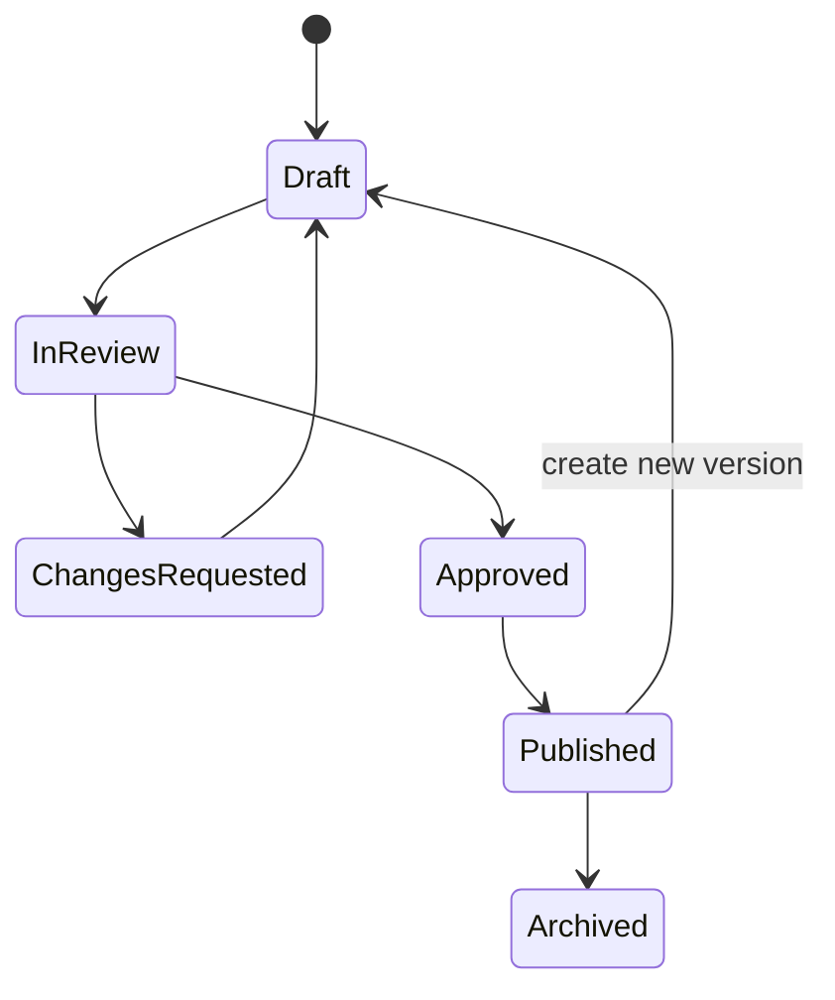

# 15 — Admin CMS dan Question Bank Specification

**Versi:** 1.0-RC2  
**Status:** Audit-resolved candidate

## 1. Tujuan

Menetapkan workflow operasional untuk product, program, konten, soal, import, review, exam form, batch, akses, dan live operations. Admin UI bukan database editor; setiap workflow memiliki validation, permission, versioning, dan audit.

## 2. Role dan permission

| Capability | Tutor/Writer | Moderator/Reviewer | Academic Admin | Operations Admin | Live-Class Coordinator | Support | Finance/Reconciliation | Super Admin |
|---|---:|---:|---:|---:|---:|---:|---:|---:|
| Create/edit draft question | Ya | Ya | Ya | Lihat metadata | Tidak | Tidak | Tidak | Ya |
| First approve question | Tidak untuk karya sendiri | Ya | Ya bila bukan creator | Tidak | Tidak | Tidak | Tidak | Ya |
| Second approve/publish ranked | Tidak | Tidak sebagai aktor sama | Ya | Tidak | Tidak | Tidak | Tidak | Ya |
| Build program/schedule | Terbatas | Review tertentu | Ya | Ya | Jadwal/live saja | Read | Tidak | Ya |
| Manual grant | Tidak | Tidak | Terbatas | Terbatas | Tidak | Request terbatas | Tidak | Ya |
| Revoke/extend access | Tidak | Tidak | Terbatas | Terbatas | Tidak | Request terbatas | Tidak | Ya |
| View purchase/webhook | Tidak | Tidak | Tidak | Redacted | Tidak | Redacted | Ya | Ya |
| Result correction | Tidak | Request/review | Approval | Operasional | Tidak | Read aman | Tidak | Ya/approval |
| Manage roles | Tidak | Tidak | Tidak | Tidak | Tidak | Tidak | Tidak | Ya |

Segregation of duties: creator tidak menyetujui soal sendiri untuk ranked exam kecuali emergency policy yang diaudit.

## 3. Shared admin patterns

- Draft → validate → review/approve → publish.
- Autosave dan unsaved-changes guard.
- Filter/saved view dan URL state.
- Bulk action menyebut target count.
- Background job untuk operasi > beberapa detik.
- Preview sebelum publish.
- Actor, timestamp, reason, correlation ID pada action sensitif.
- Optimistic UI hanya untuk action reversible dan noncritical.

## 4. Question domain

### Stable identity dan version

- `question` adalah identity/kode yang stabil.
- `question_version` immutable setelah approved/published/used.
- Draft boleh diedit; publish membuat version snapshot.
- Exam form menunjuk version, bukan question mutable.

### Question types MVP

- single choice;
- multiple/complex choice;
- true-false per statement;
- weighted choice;
- numeric answer;
- shared stimulus/passage;
- text, formula, table, and images.

SKD production memakai single choice dan weighted choice; tipe lain tetap feature-flagged sampai family gate lulus. Pada response API, keduanya memakai payload pilihan satu opsi `kind=single_choice`; `weighted_choice` membedakan scorer/secret weight, bukan bentuk input siswa.

### Classification

- exam family;
- subject/section;
- topic/subtopic;
- competency code;
- difficulty editorial;
- source/provenance/year;
- language;
- sensitivity/copyright note.

## 5. Rich content dan media

- Rich text disimpan dalam sanitized document schema, bukan arbitrary HTML.
- Formula memakai LaTeX subset yang dirender aman.
- Asset reference dapat berada pada stimulus, stem, option, dan explanation.
- Asset menyimpan original, derived variants, MIME, dimensions, checksum, alt text, `image_purpose` (`informative|decorative`), owner, and malware scan state.
- SVG disabled pada MVP kecuali sanitizer disetujui.
- ZIP entry dengan absolute path atau `..` ditolak.

## 6. Manual Question Editor

Sections:

1. identity dan classification;
2. stimulus;
3. stem dan media;
4. response schema/options;
5. answer/scoring metadata;
6. explanation;
7. source/copyright;
8. accessibility;
9. student preview;
10. review history.

Type-aware validation:

- single choice: tepat satu correct option;
- complex: minimum satu correct option dan policy partial score eksplisit;
- true/false: setiap statement memiliki expected value;
- weighted: setiap option memiliki numeric weight, tidak dikirim ke runner;
- numeric: accepted value/range/tolerance/unit policy lengkap.

## 7. Workflow status

Moderation decision memuat reviewer, checklist version, comment, dan timestamp.

## 8. Bulk import contract

### Input

- Satu XLSX v2.1 dengan sheet `Instructions`, `Questions`, `Options`, `Statements`, `NumericAnswers`, `Passages`, `Assets`, `Lookups` sesuai profil.
- Satu ZIP media opsional.
- Import profile/version.
- Default classification/status opsional.

### Idempotency

- Upload menghasilkan `import_job_id`.
- File memiliki SHA-256 checksum.
- `question_code` unik dalam tenant/namespace Superlatif.
- Mode `create_only`, `update_draft`, atau `create_revision` dipilih eksplisit.
- Re-run import job yang sama tidak membuat duplicate.

### Pipeline

`awaiting_upload → queued → scanning → parsing → validating → preview_ready → blocked|importing → completed|partial|failed|cancelled`

`blocked` dipakai ketika keamanan, format, atau keputusan operator harus diselesaikan sebelum import; ia bukan sinonim `failed`.

### Validation severity

- Error: row tidak dapat diimpor.
- Warning: dapat diimpor tetapi perlu perhatian.
- Info: normalisasi yang dilakukan sistem.

### Minimum validation

- sheet/header/template version;
- duplicate/missing question code;
- invalid taxonomy/type/status;
- missing options/answer/weight;
- unknown passage;
- media missing, duplicate, unused, invalid MIME, oversized;
- unsafe rich text/formula;
- scoring inconsistent;
- source/copyright missing jika policy mewajibkan;
- existing question collision;
- blurry/small image warning.

### Import transaction behavior

- Asset ingestion dan row import recoverable.
- Partial import hanya setelah admin memilih `Import valid rows`.
- Setiap imported row menyimpan source job/sheet/row.
- Failure report dapat diunduh dan tidak berisi signed asset URL.

## 9. Import job data

### Job

- uploader, status, template version;
- file checksums and object keys;
- requested mode/defaults;
- totals by severity/outcome;
- timestamps, retry count, error summary.

### Row

- sheet, row number, external code;
- parsed normalized payload;
- target question/version;
- outcome.

### Issue

- severity, field/column;
- stable error code;
- human message dan resolution hint;
- asset reference if relevant.

## 10. Review Queue

- Filter family, subject, author, import job, severity, age.
- Student mobile preview sebagai default.
- Metadata/scoring pane tidak tampil ke student serializer.
- Reviewer dapat approve, request changes, comment, assign, dan skip.
- `Approve all` tidak tersedia untuk ranked question tanpa sampling policy eksplisit.

Checklist:

- taxonomy;
- clarity;
- answer/scoring;
- explanation;
- media readability;
- source/copyright;
- accessibility;
- duplicate risk;
- blueprint fit.

## 11. Duplicate detection

MVP:

- exact normalized stem hash;
- asset checksum;
- same source/year/code;
- warning saat import/editor.

Semantic similarity/AI adalah fase berikutnya dan tidak auto-merge.

## 12. Question use dan exposure

Usage record menyimpan form/batch, first/last use, ranked/practice, dan exposure cohort. Form Builder memberi warning jika:

- question sudah sering terlihat oleh cohort;
- student yang sama pernah mendapat version tersebut;
- question dibatalkan/flagged;
- taxonomy melanggar composition target.

## 13. Student report issue

Siswa dapat melaporkan:

- typo/ambigu;
- gambar tidak tampil;
- dugaan kunci/pembahasan;
- masalah teknis.

Report menyimpan attempt/question version/context tanpa mengubah score otomatis. Moderator triage dan menghubungkan ke correction case bila perlu.

## 14. Correction after use

1. Moderator membuat issue dan proposed new version.
2. Academic reviewer menentukan severity.
3. System menghitung affected forms/attempts.
4. Preview scoring impact.
5. Peer approval.
6. Correction workflow membuat result version baru.
7. Student diberi notice jika hasil berubah.

Question version lama tetap ada untuk audit.

## 15. Program/Product/Batch builders

Builder share framework:

- identity + version;
- section validation;
- preview;
- publish checklist;
- impact analysis untuk objek aktif;
- audit timeline.

Tidak boleh mempublikasikan:

- product version tanpa grant component;
- offer tanpa price/window/mapping yang valid;
- program dengan dependency cycle;
- exam form dengan composition error;
- batch tanpa form, attempt policy, dan result windows.

## 16. Entitlement Manager

Search user/order/external ID/program/batch. Tampilan:

- purchases;
- raw grants;
- effective access;
- expiry timeline;
- reconciliation issues;
- audit history.

Actions:

- grant, extend, suspend, resume, revoke;
- replay/reprocess verified commerce event;
- relink unresolved source dengan elevated permission;
- rebuild projection.

Setiap action melakukan dry-run terlebih dahulu dan memperlihatkan access yang tetap ada dari source lain.

## 17. Live Operations

Read-mostly dashboard:

- attempts active/started/submitted;
- answer save success/latency/error;
- offline/sync backlog;
- scoring queue;
- provider/system incident;
- support cases.

Actions terkontrol:

- grant accommodation time;
- invalidate/reopen attempt sesuai policy;
- pause batch hanya jika contract mendukung;
- communication to affected cohort;
- create incident.

Answer content tidak dapat diedit.

## 18. Audit requirements

Audit event memuat:

- actor type/id/session;
- action;
- object type/id/version;
- before/after diff teredaksi;
- reason dan approval reference;
- IP/device metadata sesuai privacy policy;
- request/correlation ID;
- timestamp server.

Audit log append-oriented; koreksi audit dibuat sebagai event baru.

## 19. Background jobs

- import parse/validation/commit;
- asset variants/scan;
- publish projections;
- result scoring/correction;
- access rebuild/reconciliation;
- export;
- notification.

Job memiliki idempotency key, status, attempts, next retry, dead-letter reason, dan correlation ID.

## 20. Acceptance scenarios

1. Admin mengunggah 500 soal dan ZIP; 472 valid, 18 warning, 10 error; baris valid dapat diimpor tanpa duplicate.
2. Opsi D TKP tanpa bobot menghasilkan row-level error.
3. Gambar tidak ditemukan menunjuk file dan row yang benar.
4. Soal published yang diedit menghasilkan version baru.
5. Writer tidak dapat approve soal sendiri untuk ranked batch.
6. Revoke purchase grant menunjukkan scholarship yang masih menjaga access.
7. Admin meninggalkan halaman import; job selesai dan notification tersedia.
8. Correction case tidak menimpa result lama.

## 21. Export dan backup

- Question bank export mengikuti filter dan permission.
- Answer/scoring fields hanya bagi role yang berhak.
- Asset export menggunakan manifest, bukan public permanent URL.
- Backup database bukan pengganti domain export.

## 22. Open decisions

### Audit resolution RC2

Kontrak kolom, tipe soal, alt text, matematika, idempotency, dan ZIP berada di `15A_QUESTION_IMPORT_TEMPLATE_CONTRACT.md`. Workbook hanya boleh mengirim status `draft|in_review`; approval/publish hanya melalui workflow. Kunci dan bobot disimpan pada restricted academic secret store dan tidak ikut serializer attempt siswa. Family non-SKD dapat diimpor sebagai `draft_only`, tetapi tidak dipublish tanpa activation gate.

- Ukuran maksimal XLSX/ZIP dan jumlah soal per job setelah load test.
- Reviewer quorum untuk correction besar.
- Apakah AI duplicate detection masuk fase 1.1.
- Copyright/source policy wajib per exam family.
