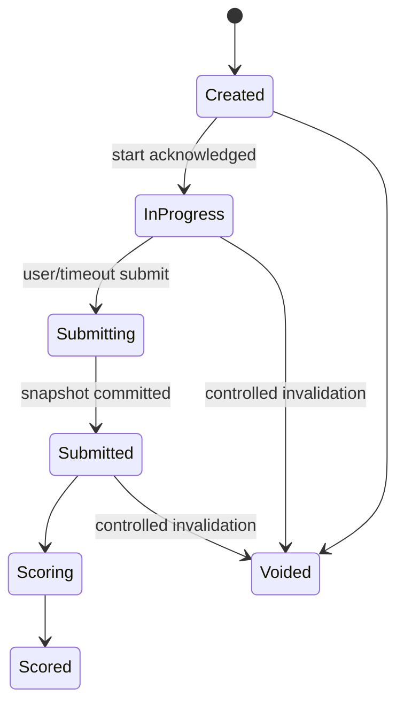

# 16 — Exam Engine Core Contract v2

**Versi:** 2.1-RC2  
**Status:** Audit-resolved; security dan load review wajib sebelum produksi  
**Target pertama:** SKD Sekolah Kedinasan

## 1. Tujuan

Kontrak ini mendefinisikan invariant exam engine yang harus konsisten pada API, database, client, worker, test, dan live operations. Core dapat digunakan banyak exam family, tetapi aktivasi setiap family membutuhkan blueprint dan scoring gate sendiri.

## 2. Non-negotiable

1. Timer dan deadline server-authoritative.
2. Attempt start, answer save, submit, dan scoring idempotent.
3. Satu user dapat memiliki beberapa attempt sesuai policy.
4. Form, question versions, presented order, blueprint, dan scoring policy disnapshot.
5. Kunci, bobot, dan explanation tidak keluar sebelum release policy.
6. Jawaban acknowledged tidak hilang.
7. Client timestamp tidak menentukan pemenang konflik.
8. Background/tab visibility bukan verdict cheating.
9. Scoring deterministic dan fixture-tested.
10. Correction menghasilkan result version baru; history tidak ditimpa.

## 3. Concept separation

| Konsep | Fungsi |
|---|---|
| Exam family | Kategori aturan/regulasi |
| Blueprint version | Struktur, timer, navigation, scoring, result policy |
| Exam form | Susunan immutable question versions |
| Batch | Window operasional dan cohort |
| Attempt policy | Allowance, resume, ranking, accommodation |
| Attempt | Pengerjaan seorang user |
| Question instance | Question version dan option order yang dipresentasikan |
| Answer state | Jawaban terkini yang authoritative |
| Answer mutation | Log append-oriented perubahan jawaban |
| Submission | Finalization request/result |
| Result version | Output scoring berversi |

## 4. Attempt state machine

Attempt state berhenti pada `scored|voided`. Result lifecycle terpisah dan berversi: `processing → provisional → final`, dengan cabang `corrected|withheld|voided`. Kegagalan worker adalah job/error state, bukan result state siswa.

State `paused` hanya digunakan jika blueprint/policy eksplisit mendukung. App background tidak mem-pause timer.

## 5. Start attempt

### Preconditions

- authenticated user;
- effective access `start_attempt` allowed;
- batch attempt window open;
- allowance remaining;
- form/blueprint published and compatible;
- no blocking incident/policy.

### Request

- batch ID;
- idempotency key;
- client capability metadata;
- requested resume/create mode.

### Transaction

1. Lock/evaluate allowance.
2. Reuse attempt for same idempotency key.
3. Create attempt number.
4. Snapshot policy, form, blueprint, scoring identifiers and critical JSON.
5. Generate presented question and option order server-side.
6. Persist question instances/order.
7. Set `started_at`, `deadline_at`, `late_sync_cutoff_at` from server.
8. Issue writer lease.

Response never includes correct answer or weights.

## 6. Deterministic presentation

- Ranked MVP tidak memilih question dari pool. Jika question policy secara eksplisit mengizinkan option shuffle, randomness memakai secure server seed/HMAC-derived seed dan hasil order disimpan.
- Presented order is persisted explicitly, not reconstructed only from algorithm implementation.
- Option order is stored per question instance.
- Shared stimulus relation is preserved.
- Option-order policy is part of blueprint/form snapshot; question order ranked tetap fixed.
- Same attempt always resumes the same presentation.

Algorithm implementation may change for future attempts without changing old attempts.

## 7. Writer lease dan multi-device

Untuk mencegah silent last-write-wins:

- Satu attempt memiliki satu active writer lease.
- Lease memiliki token hash, device/session, issued/renewed/expiry.
- Lease diperbarui saat client aktif.
- Perangkat kedua dapat read-only atau melakukan explicit takeover.
- Takeover membatalkan lease lama dan dicatat.
- Mutation dari lease lama ditolak dengan `WRITER_LEASE_REVOKED`.

Client lama tidak boleh mengirim antrean offline setelah takeover tanpa conflict recovery. Tidak ada merge otomatis berdasarkan jam perangkat.

## 8. Answer save contract

### Request fields

- `attempt_id`;
- `question_instance_id`;
- `client_mutation_id` UUID;
- `writer_lease_token`;
- `expected_answer_revision`;
- typed answer payload;
- `captured_at_client` untuk telemetry, bukan ordering authority.

### Processing

1. Authenticate session dan writer lease.
2. Validate attempt state/window.
3. Deduplicate `client_mutation_id`.
4. Validate answer schema from snapshotted question type.
5. Compare `expected_answer_revision` dengan current revision.
6. Jika sama, append mutation, update current answer, increment revision, commit.
7. Jika payload sama dengan current, return idempotent success.
8. Jika berbeda dan stale, return `409 ANSWER_REVISION_CONFLICT` dengan safe current state.

Response:

- accepted/current answer revision;
- server saved timestamp;
- attempt server revision;
- server time/deadline summary;
- sync status.

### Mapping question type ke answer payload

| Question type | `answer.kind` | Payload siswa |
|---|---|---|
| `single_choice` | `single_choice` | Satu `optionCode` |
| `weighted_choice` | `single_choice` | Satu `optionCode`; bobot tetap secret dan hanya dibaca scorer server |
| `multiple_choice` | `multiple_choice` | Array unik `optionCodes` |
| `statement_true_false` | `statement_true_false` | Map statement code ke boolean |
| `numeric` | `numeric` | Nilai desimal sebagai string ternormalisasi |

`weighted_choice` adalah perbedaan scoring, bukan bentuk interaksi. Client dan API tidak menerima atau mengirim option weight.

## 9. Offline queue

Client queue minimum:

- mutation ID;
- question instance;
- expected revision;
- typed payload;
- captured time;
- local order;
- lease/session reference;
- retry state.

Rules:

- UI menampilkan `Menunggu koneksi` sampai server ack.
- Queue dikirim berurutan per question.
- Retry memakai mutation ID yang sama.
- Konflik menghentikan queue untuk question tersebut dan meminta resolution/resume state.
- Queue disimpan terbatas dan dienkripsi sejauh kemampuan browser/platform.
- Logout/explicit discard memperingatkan unsynced answers.

## 10. Timer dan deadline

- `deadline_at = started_at + allowed_duration + approved_extension`, dibatasi batch policy.
- Client menghitung tampilan dari server time offset tetapi server memutuskan.
- Reload tidak mengubah deadline.
- Warning threshold dikonfigurasi blueprint.
- Extension membuat audit event dan response resume terbaru.

### Late sync

Default ranked policy:

- Mutations diterima normal jika sampai server sebelum deadline.
- Mutation yang sampai setelah deadline dan sebelum `late_sync_cutoff_at` disimpan sebagai recovery candidate.
- Candidate tidak pernah masuk scoring otomatis. Adjudikasi terkontrol menentukan diterima/ditolak dan membuat result version/audit yang sesuai.
- Mutation setelah cutoff ditolak untuk scoring tetapi dapat dicatat sebagai diagnostic telemetry.

Untuk MVP simulasi, draft default adalah cutoff 30 detik dan reviewable recovery; angka final melalui load/abuse test.

Presedensi timing kanonik adalah `attempt_accommodation → batch_attempt_policy → blueprint_default`. Accommodation hanya menambah/membatasi field yang diizinkan dan tidak dapat mengubah form, scorer, atau ranking rule.

## 11. Resume contract

Resume mengembalikan:

- attempt state;
- server time, deadline, cutoff;
- writer lease status/new lease;
- presented sections/questions/order;
- current answers and revisions;
- flagged questions;
- current question;
- submission/result state;
- incident/accommodation state;
- permitted actions.

Kontrak API memakai field: `sections[]`, `instances[]` dengan student-safe question content, `current_instance_id`, `submission_state`, `incident_state`, `accommodation`, dan `permitted_actions[]`. `additionalProperties=false` berarti penambahan field baru harus melalui versi kontrak, bukan payload ad hoc.

Resume payload menggunakan student serializer dan tidak menyertakan scoring secret.

## 12. Navigation dan flag

- Navigation policy: `free`, `section_restricted`, atau `forward_only`. Perilaku lain membutuhkan schema/version baru; tidak ada escape hatch generik `configured` pada MVP.
- `flagged` adalah state user dan tidak memengaruhi answered state.
- Section transition dapat memerlukan confirmation jika tidak dapat kembali.
- Current position disimpan sebagai convenience state, bukan scoring input.

## 13. Submit contract

### User submit

1. Client meminta submit summary.
2. Server mengembalikan answered/unanswered/flagged/sync issue counts.
3. Client mengirim final submit dengan idempotency key dan expected attempt revision.
4. Server mengunci answer snapshot dan menandai `submitted_at`.
5. Scoring job dibuat transactional outbox.

### Timeout submit

- Scheduler/worker dan request path dapat memicu finalization secara idempotent.
- Hanya satu submission snapshot menang.
- Unsynced recovery candidates mengikuti policy, tidak menunda seluruh batch tanpa batas.

### Response

- submission ID/status;
- received time;
- result expected/release state;
- unresolved recovery status bila ada.

## 14. Scoring contract

Scoring input hanya:

- submission answer snapshot;
- question versions;
- scoring policy snapshot;
- blueprint/form snapshot;
- approved corrections/accommodations.

Scoring tidak membaca question draft terbaru.

Output:

- total and section raw scores;
- max scores;
- threshold evaluation and category;
- topic aggregates;
- unanswered/invalid counts;
- scoring engine version;
- input checksum;
- computation trace yang aman untuk internal;
- display interpretation keys.

## 15. SKD scoring adapter

Draft adapter mendukung:

- binary correct/incorrect scores untuk TWK/TIU;
- weighted option score untuk TKP;
- zero untuk unanswered;
- threshold per section/category/version;
- total and maximum;
- pass evaluation hanya jika regulatory policy telah disetujui.

Angka threshold tidak ditulis di core contract. Fixture version berasal dari academic/regulatory review.

## 16. Result lifecycle

- `processing`
- `provisional`
- `final`
- `corrected`
- `withheld` untuk review terkontrol bila perlu
- `voided` untuk attempt/result yang dibatalkan secara terkontrol

Release nilai, leaderboard, dan explanation dapat berbeda waktunya.

Student serializer:

- sebelum result release: status/timestamp saja;
- setelah result: score dan interpretation yang diizinkan;
- sebelum review release: tanpa correct answers/weights/explanation;
- setelah review: answer comparison dan explanation sesuai policy.

## 17. Correction

Correction case memuat:

- cause dan evidence;
- affected question versions/forms/batches/attempts;
- proposed scoring change;
- preview impact;
- requester dan approvers;
- published notice.

Re-score menghasilkan result version baru. Prior result tetap tersimpan dan status current pointer berubah dalam transaction.

## 18. Ranking

- Eligibility publik ditentukan effective access; attempt yang dihitung untuk ranking ditentukan batch `ranking_attempt_rule`.
- Ranking snapshot menyimpan user pseudonymous reference, score tuple, tie-break values, dan cohort.
- Display name di-resolve saat baca sesuai privacy preference.
- Tie-break policy berversi.
- Corrected result dapat memicu ranking version baru.

## 19. Error model

Stable error codes:

- `ATTEMPT_WINDOW_CLOSED`
- `ATTEMPT_LIMIT_REACHED`
- `ATTEMPT_NOT_RESUMABLE`
- `WRITER_LEASE_REQUIRED`
- `WRITER_LEASE_REVOKED`
- `ANSWER_REVISION_CONFLICT`
- `ANSWER_SCHEMA_INVALID`
- `ATTEMPT_DEADLINE_PASSED`
- `LATE_SYNC_REVIEW_REQUIRED`
- `SUBMISSION_ALREADY_FINALIZED`
- `RESULT_NOT_RELEASED`
- `EXPLANATION_NOT_RELEASED`
- `EXAM_INCIDENT_ACTIVE`

Error response memiliki request ID dan recovery action aman.

## 20. Security

- Question serializer allowlist per state.
- Correct answer/weight stored server-side dengan restricted query path.
- No direct object storage URL for protected media; use short-lived access.
- Rate limit per user/attempt/IP dengan false-positive safeguards.
- Payload size and rich-content validation.
- Writer lease token hanya disimpan hash di server.
- Audit sensitive admin actions.

## 21. Observability

Metrics:

- attempt start success/error;
- active attempts;
- answer save p50/p95/p99 dan error codes;
- revision conflicts;
- offline backlog/recovery candidates;
- timeout/submission lag;
- scoring queue/runtime/failure;
- result correction count;
- writer takeover.

Logs tidak memuat answer payload secara default.

## 22. Test invariants

1. Same idempotency key menghasilkan satu attempt/submission.
2. Same mutation ID tidak menambah revision dua kali.
3. Stale different mutation tidak menimpa current answer.
4. Takeover membatalkan writer lama.
5. Reload mempertahankan deadline, question order, option order, dan answers.
6. Scoring sama untuk input checksum yang sama.
7. Question edit setelah attempt tidak mengubah score.
8. Submit dan timeout race menghasilkan satu snapshot.
9. Correction tidak menghapus result sebelumnya.
10. Student payload tidak pernah mengandung key/weight sebelum release.
11. Refund/access change setelah attempt start mengikuti explicit policy, bukan tiba-tiba menghapus attempt.

## 23. Load and failure tests

- 1.000 concurrent attempts baseline.
- burst autosave saat section/timer warning.
- Redis/cache unavailable.
- worker delay.
- database failover/transient error.
- network offline/reconnect mobile.
- duplicate/out-of-order requests.
- server clock synchronization.
- storage/CDN media failure.
- submit at exact deadline.

## 24. Open decisions

### Audit resolution RC2

- Satu final submit per attempt; section behavior hanya navigasi berversi, bukan submit terpisah tanpa aturan resmi.
- Submit menunggu antrean maksimal 30 detik. Mutation yang tiba sampai `late_sync_cutoff_at` menyimpan payload, writer lease, waktu, checksum, dan state sebagai recovery candidate; tidak otomatis masuk answer set/scoring.
- Kandidat material menahan finalisasi pada `withheld` sampai adjudikasi. Keputusan menghasilkan result version baru, pointer current berpindah atomik, dan versi lama tetap tersedia untuk audit.
- Writer lease mempunyai flag `is_active` dengan partial unique index. Service wajib menutup lease kedaluwarsa sebelum acquire/takeover; predicate index tidak menggunakan fungsi waktu volatile.
- Attempt menyimpan FK dan checksum form, blueprint, scoring policy, attempt policy snapshot, akomodasi, deadline/cutoff, serta start idempotency key.

- Final writer lease duration dan takeover UX.
- Late-sync automatic inclusion versus manual review.
- Section timer behavior per future family.
- Ranking tie-break and privacy defaults.
- Accommodation governance.
