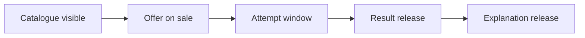

# 18 — Flash Sale dan Tryout Batch System

**Versi:** 1.0-RC2  
**Status:** Audit-resolved candidate

## 1. Tujuan

Memisahkan lifecycle penjualan dari lifecycle ujian agar dua batch per minggu, Tryout Pass, bundle, promo, hasil, leaderboard, dan pembahasan dapat dioperasikan tanpa hardcode.

## 2. Domain boundaries

| Objek | Mengatur |
|---|---|
| Product | Hal yang dijual secara stabil |
| Product version | Benefit/grant yang dijanjikan |
| Offer | Harga, sale window, visibility, eligibility, quota |
| External SKU mapping | Hubungan offer dengan Sejoli |
| Batch | Event operasional ujian |
| Exam form | Susunan soal immutable |
| Attempt policy | Allowance/resume/ranking |
| Access grant | Alasan user dapat mengikuti batch |

Harga tidak berada di batch. Exam window tidak berada di offer.

## 3. Timeline model

Window independen:

- catalogue visibility;
- sale start/end;
- registration/access claim;
- attempt start/end;
- late-sync cutoff;
- provisional result;
- final result;
- leaderboard visibility;
- explanation/review;
- access end.

Validation memastikan urutan logis tetapi mengizinkan overlap yang memang dimaksud.

## 4. Offer state

`draft`, `scheduled`, `on_sale`, `sold_out`, `ended`, `hidden`, `archived`.

State dihitung dari status, waktu server, dan enforced quota. Countdown hanya tampil untuk fixed sale end yang nyata.

## 5. Batch state siswa

- Segera hadir.
- Flash sale berlangsung.
- Menunggu pembayaran.
- Sudah dimiliki.
- Bisa dikerjakan.
- Sedang dikerjakan.
- Menunggu hasil.
- Hasil tersedia.
- Pembahasan tersedia.
- Akses berakhir.

Resolver state mempertimbangkan purchase, effective access, attempt, batch windows, dan result release; UI tidak merakit logika sendiri.

## 6. Produk satuan

Product version memberi:

- target batch;
- attempt allowance;
- ranking eligibility;
- result/review visibility;
- validity/access end;
- bonus resource opsional.

Satu purchase menghasilkan grant source-specific. Duplicate order tidak membuat duplicate batch card.

## 7. Tryout Pass

### Named-list pass

Menyebut batch tertentu. Paling aman untuk MVP.

### Bounded dynamic pass

Contoh: seluruh batch SKD dengan attempt start antara 1–30 September 2026.

Rules:

- family, date bounds, and exclusions explicit;
- rule version immutable;
- child grants dibuat saat eligible batch published;
- entitlement expansion idempotent;
- catalogue copy menjelaskan batas.

Default MVP: named list; dynamic pass hanya setelah test.

## 8. Bundle inclusion

Kelas Akselerasi dapat memberi:

- named future batches;
- bounded batch series;
- attempt policy berbeda dari product satuan;
- bonus review/resource.

Jika user memiliki bundle dan batch single, allowance digabung sesuai policy paling permisif yang eksplisit; ranking tetap mengikuti batch rule.

## 9. Quota

Quota hanya dipakai bila kapasitas benar-benar enforced.

- source: offer inventory atau operational capacity;
- reservation optional dengan expiry;
- sold count berasal dari settled/reserved policy yang terdokumentasi;
- concurrency exam bukan marketing stock;
- overbooking dan release reservation diaudit.

Tanpa quota nyata, UI tidak menampilkan stok tersisa.

## 10. Checkout handoff

1. App membuat checkout intent/correlation ID.
2. App mengevaluasi existing access/overlap.
3. User menerima ringkasan benefit dan periode.
4. Redirect ke mapped Sejoli checkout URL.
5. Return URL membawa opaque intent, bukan status dipercaya.
6. App membaca purchase projection dari verified event/reconciliation.
7. Jika paid belum terprovisi, tampilkan `Akses sedang disiapkan`.

## 11. Upgrade

- Offer memiliki `upgrade_from` eligibility.
- Benefit delta ditampilkan sebelum checkout.
- Existing purchase tidak dihapus.
- Upgrade menghasilkan grant tambahan atau supersession eksplisit.
- Proration bukan scope kecuali Sejoli memberi contract yang dapat diverifikasi.

## 12. Batch publish validation

- form and blueprint published;
- attempt policy valid;
- all question versions approved;
- windows/timezone coherent;
- result/review policy defined;
- scoring fixtures pass;
- access path exists;
- notification schedule valid;
- live-ops owner assigned;
- support copy/runbook linked.

## 13. Operational cadence example

| Event | Sale | Attempt | Final result |
|---|---|---|---|
| Batch 01 | Senin–Selasa | Rabu–Kamis | Jumat |
| Batch 02 | Kamis–Jumat | Sabtu–Minggu | Senin |

Ini template operasional, bukan rule sistem. Waktu actual tersimpan sebagai ISO timestamp dan timezone Asia/Jakarta.

## 14. Notifications

Trigger:

- offer opened;
- sale ending;
- payment pending/settled;
- batch starting;
- attempt deadline approaching;
- result released;
- explanation released;
- schedule changed;
- incident resolved.

Frequency caps dan channel preference berlaku. Reminder operasional dibedakan dari promosi.

## 15. Leaderboard

- Cohort dan eligible attempts eksplisit.
- Best/first/latest attempt policy berversi.
- Tie-break berversi.
- Result correction membuat snapshot baru.
- Display name resolved at read time.
- User dapat memilih privacy display sesuai policy.

Leaderboard boleh dimatikan per batch.

## 16. Result and review release

- Provisional result dapat dirilis sebelum final hanya jika copy jelas.
- Final result memerlukan scoring completion dan release action/schedule.
- Explanation release dapat setelah seluruh attempt window.
- Admin emergency hold memerlukan reason dan audience notice.

## 17. Incident behavior

Incident dapat memengaruhi:

- batch start/end extension;
- individual accommodation;
- result hold;
- notification;
- retry/reopen policy.

Tidak ada bulk extension tanpa impact preview, permission, reason, dan audit.

## 18. Reconciliation cases

- paid order no grant;
- grant no eligible purchase/source;
- unknown SKU;
- duplicate order;
- refund after attempt;
- pass missing child grant;
- sale quota mismatch;
- checkout intent never resolved.

Setiap case memiliki owner, severity, status, evidence, resolution, dan audit.

## 19. Analytics

- offer viewed → checkout intent → settled → access active;
- time to access;
- batch detail → start → submit → result/review;
- flash-sale conversion by legitimate window;
- pending-payment recovery;
- duplicate/overlap warning effectiveness;
- pass utilization.

## 20. Acceptance scenarios

1. Sale selesai tidak menutup attempt user yang sudah memiliki access.
2. User membeli single batch lalu bundle; batch tampil sekali.
3. Refund single product tidak mencabut access dari bundle.
4. Dynamic pass tidak memasukkan batch Oktober di luar bound September.
5. Paid webhook terlambat tidak meminta user membayar ulang.
6. Result rilis tetapi explanation belum rilis menghasilkan state berbeda.
7. Sold out hanya muncul saat enforced quota habis.

## 21. Open decisions

### Audit resolution RC2

Batch adalah satu-satunya pemilik `ranking_attempt_rule`; policy product/blueprint tidak menimpanya. State kanonik mengikuti seluruh window: draft, scheduled, registration_open, exam_open, exam_closed, scoring, provisional_released, final_released, review_open, voided, archived. Refund tidak menghapus attempt/result/ranking historis. Form retired dari ranked use setelah kunci atau pembahasan dirilis.

- Named-list versus dynamic Tryout Pass untuk launch.
- Best/first attempt ranking policy.
- Duplicate purchase prevention versus post-purchase handling.
- Quota/reservation bila campaign memerlukan.
