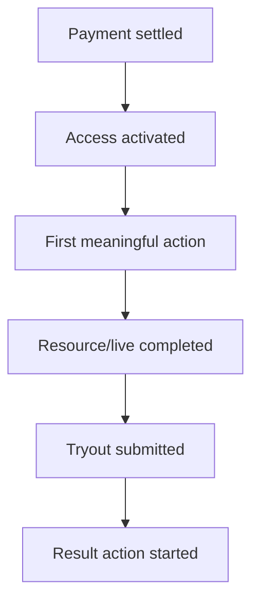

# 19 — Analytics, Ethical Habit, dan Notification Specification

**Versi:** 1.0-RC2  
**Status:** Audit-resolved candidate

## 1. Tujuan

Mengukur core learning loop dan mengirim pengingat yang membantu tanpa mengubah Superlatif menjadi sistem gamifikasi manipulatif.

## 2. Measurement principles

1. Ukur outcome dan reliability, bukan hanya click/pageview.
2. Event tidak menyimpan jawaban, token, meeting URL, atau raw message sensitif.
3. Event name dan property schema berversi.
4. Server events digunakan untuk payment, access, submit, scoring, dan delivery truth.
5. Client events digunakan untuk impression/interaksi, bukan truth transaksi.
6. PII menggunakan internal pseudonymous user reference.
7. Consent dan retention mengikuti kebijakan final.

## 3. Core funnel

### Activation metrics

- payment-to-access success;
- access activation latency;
- onboarding completion;
- first meaningful action within 1/24/72 hours.

### Learning metrics

- next action start rate;
- required progress;
- live class join;
- resource completion;
- attempt start-to-submit;
- remediation start;
- return interval yang sehat.

### Reliability metrics

- webhook/access mismatch;
- answer save failure/conflict;
- scoring failure/correction;
- import error;
- notification delivery failure;
- support intervention.

## 4. Event envelope

Semua event:

- `event_id` UUID;
- `event_name`;
- `schema_version`;
- `occurred_at` server/client plus source;
- `received_at`;
- pseudonymous `actor_id`;
- `anonymous_id` bila pre-login;
- session/device class;
- program/product/batch/resource references bila relevan;
- source `client|server|worker|commerce_bridge`;
- correlation/request ID;
- properties allowlist.

## 5. Event families

### Identity/access

- `session_started`
- `account_link_succeeded|failed`
- `purchase_status_changed`
- `access_grant_changed`
- `effective_access_changed`
- `reconciliation_case_created|resolved`

### Program/learning

- `home_viewed`
- `next_action_impression|clicked`
- `program_opened`
- `resource_started|progressed|completed`
- `live_class_joined`
- `recording_started|completed`

### Exam

- `batch_viewed`
- `attempt_started|resumed|submitted`
- `answer_save_failed` aggregate/error-only;
- `result_viewed`
- `explanation_opened`
- `remediation_started`

### Commerce

- `offer_viewed`
- `checkout_intent_created`
- `checkout_returned`
- `payment_settled`
- `access_activated_from_purchase`

### Admin

- `import_job_completed`
- `question_approved`
- `program_published`
- `batch_published`
- `manual_access_changed`
- `result_correction_published`

## 6. Prohibited event properties

- answer payload/selected option;
- correct answer/weight;
- password, OTP, token, secret;
- full email/phone/name in generic analytics;
- private meeting URL;
- raw webhook payload;
- health/psychological inference;
- rich text question content.

## 7. Attribution

- Marketing attribution dapat membawa UTM/referrer/campaign ke checkout intent.
- Settled purchase memakai server correlation bila tersedia.
- Last-click tidak dianggap satu-satunya kebenaran bisnis.
- Affiliate/commission tetap source of truth Sejoli pada MVP.

## 8. Ethical habit model

| Hook stage | Implementasi | Guardrail |
|---|---|---|
| Trigger | kelas mulai, deadline nyata, hasil rilis, study plan | frequency cap dan preference |
| Action | satu tap menuju next action | tidak ada endless feed |
| Reward | pemahaman, feedback, milestone, progres | tidak ada random reward/purchase mystery |
| Investment | goal, progress, plan, reflection | tidak menghapus progres karena absen |

Streak ditunda sampai core loop terbukti. Jika diaktifkan, bersifat opt-in/secondary dan tidak membuka access.

## 9. Next-action measurement

- impression dicatat sekali per projection/version/view;
- click menyimpan reason code dan target type;
- start/server truth menghubungkan correlation;
- completion diukur terpisah;
- compare resolver reason, bukan copy text.

## 10. Notification categories

| Category | Contoh | Default control |
|---|---|---|
| Security | login/perangkat baru | Wajib, kanal terbatas |
| Transactional | payment/access/refund | Wajib secara operasional |
| Exam critical | batch start, incident, result | Aktif untuk participant |
| Schedule | class reminder/reschedule | Preference + critical override terbatas |
| Learning | roadmap reminder/new resource | Preference |
| Community | mentor/pengumuman | Preference |
| Promotional | flash sale/offer | Explicit opt-in/allowed basis |

Mematikan promosi tidak mematikan transactional/security.

## 11. Channels

- In-app notification center.
- Email.
- WhatsApp melalui provider yang dikonfigurasi.
- Web push fase berikutnya.

Provider adapter menerima normalized message request. Template WhatsApp mengikuti approval/provider constraints.

## 12. Notification lifecycle

`planned → queued → provider_accepted → delivered/read(optional) → failed → retried/dead`

Data:

- trigger/event;
- audience snapshot/query version;
- template and locale version;
- channel;
- recipient reference;
- idempotency key;
- provider message reference;
- status/failure;
- timestamps;
- preference/consent decision.

## 13. Idempotency dan frequency

- Key minimal: user + trigger + object + template version + scheduled occurrence.
- Retry tidak membuat pesan baru.
- Frequency caps per category/channel.
- Reschedule membatalkan job lama dan membuat occurrence baru.
- Notification expired tidak dikirim terlambat bila sudah tidak berguna.

## 14. Audience resolution

- Evaluate effective access dan object relevance saat job dibuat/kirim sesuai use case.
- Security/transactional memakai exact user.
- Program broadcast memakai audience query snapshot dan exclusion.
- Promotional audience menghormati consent dan suppression.

## 15. Templates

- Stable template code dan immutable version.
- Variables allowlisted dan validated.
- Preview seluruh channel.
- No false urgency.
- Date/timezone explicit.
- Deep link aman dan tidak membawa token sensitif.

## 16. Dashboards

### Product

- activation funnel;
- program next-action performance;
- completion and return;
- batch participation/result action.

### Operations

- payment-to-access lag;
- reconciliation backlog;
- exam save/submit health;
- import/review throughput;
- notification failures.

### Guardrail

- unsubscribe/complaint;
- support incidents;
- duplicate purchases;
- abnormal reminder frequency;
- correction rate.

## 17. Experimentation

MVP tidak membutuhkan experimentation platform penuh. Setiap experiment:

- hypothesis dan primary/guardrail metric;
- eligibility dan allocation;
- start/end;
- no scoring/access behavior experimentation tanpa approval;
- no dark pattern;
- result documented.

## 18. Data quality

- Event schema validation.
- Duplicate event detection.
- Server/client reconciliation untuk core funnel.
- Late event handling.
- Known bot/internal/test traffic flags.
- Daily quality checks untuk missing critical events.

## 19. Retention dan deletion

- Raw analytics retention provisional 13 bulan.
- Aggregates dapat disimpan lebih lama tanpa direct identifiers.
- User deletion/anonymization mengikuti legal and operational retention.
- Transaction/exam audit tidak dihapus hanya karena analytics deletion; purposes dibedakan.

## 20. Acceptance scenarios

1. Payment settled tetapi access gagal terlihat pada reliability dashboard.
2. Retry WA tidak mengirim duplikat.
3. Promo opt-out tetap menerima reschedule kelas yang dimiliki.
4. Analytics attempt event tidak berisi selected answer.
5. Next-action impression/click/start dapat direkonsiliasi.
6. Reminder kedaluwarsa tidak dikirim setelah kelas selesai.
7. Internal/test account dapat dikeluarkan dari KPI.

## 21. Open decisions

### Audit resolution RC2

Daftar §5 adalah taksonomi kanonik. Seluruh event memakai `schema_version`, actor/session pseudonym, properties allowlist, dan retensi analytics maksimum 395 hari; record legal/audit disimpan pada domain store terpisah. Kunci/bobot, private meeting URL, raw webhook, PII, jawaban, serta inferensi kesehatan/psikologis dilarang. WhatsApp hanya untuk kategori dengan opt-in eksplisit dan template/provider policy yang sah.

- Analytics vendor versus first-party event store/warehouse.
- Consent wording dan retention final.
- Frequency caps WA/email.
- Streak validation phase.
