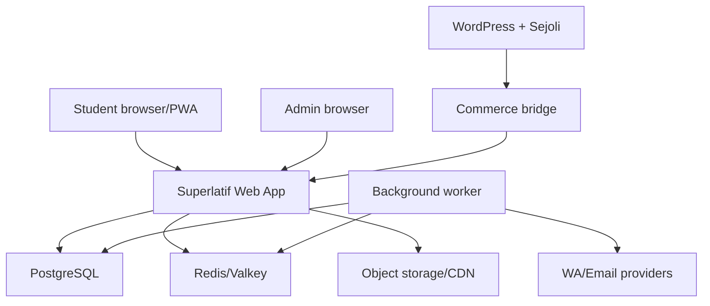

# 20 — Technical Architecture

**Versi:** 1.0-RC2  
**Status:** Provisional architecture; vendor spike dan load test required  
**Style:** Modular monolith + isolated worker/hot-path deployment

## 1. Decision summary

Superlatif tidak membutuhkan microservices pada MVP. Rekomendasi adalah TypeScript modular monolith dengan web/BFF dan worker terpisah secara deployment, satu PostgreSQL sebagai transactional source of truth, Redis-compatible infrastructure untuk queue/cache/coordination, serta object storage untuk media.

| Layer | Draft choice |
|---|---|
| Web student/admin | Next.js 16 App Router, React, TypeScript |
| API/BFF | Route handlers/services dalam modular monolith |
| Worker | Node.js TypeScript process/container |
| Database | PostgreSQL managed; Supabase Postgres provisional |
| ORM/migration | Drizzle schema + generated/reviewed SQL migrations |
| Queue/cache | Redis/Valkey-compatible + durable job semantics |
| Media | S3-compatible object storage + CDN/signed access |
| Commerce | WordPress/Sejoli + bridge adapter |
| Delivery | Vercel untuk web; container/VPS untuk worker/hot path |
| Observability | OpenTelemetry-compatible traces, structured logs, metrics, error tracking |

Versi framework dicatat di lockfile saat implementation kickoff. Dokumen ini tidak mewajibkan auto-upgrade setiap rilis.

## 2. Architecture principles

1. Mulai sebagai modular monolith.
2. Pisahkan domain boundary di kode sebelum memisahkan service.
3. PostgreSQL adalah source of truth transactional.
4. Cache/projection dapat dibangun ulang.
5. Semua integration event idempotent.
6. Hot path exam tidak bergantung pada marketing/analytics provider.
7. Async side effects memakai transactional outbox.
8. Security secret dan scoring key tidak berada di client.
9. Vendor adapter berada di boundary, bukan menyebar ke domain.
10. Operability dan recovery adalah bagian acceptance.

## 3. System context



## 4. Deployment units

### Web

- Student and admin UI.
- Authentication/session endpoints.
- Read APIs/BFF.
- Command endpoints including attempt hot path.
- Health/readiness appropriate to platform.

### Worker

- commerce normalization/reconciliation;
- grant/access projection;
- import/asset processing;
- scoring/correction;
- notification;
- exports;
- schedule/timeouts.

### Optional exam API container

Tidak dibuat pada hari pertama. Dipisahkan dari web hanya jika load test/platform runtime menunjukkan kebutuhan. Interface tetap service/module contract yang sama.

## 5. Code organization

```text
apps/
  web/
  worker/
packages/
  domain/
    identity/
    commerce/
    access/
    programs/
    content/
    schedules/
    questions/
    exams/
    attempts/
    results/
    notifications/
  database/
  contracts/
  observability/
  integrations/
    wordpress-sejoli/
    object-storage/
    messaging/
```

Domain packages tidak mengimpor UI atau vendor SDK langsung.

## 6. Request architecture

- `/api/v1/*` menggunakan stable REST contract.
- Browser menggunakan same-origin secure session cookie.
- Commands menerima idempotency key bila dapat diulang.
- Correlation ID diteruskan ke log/job/outbox.
- Validation di API boundary; invariant tetap dijaga service/database.
- Admin dan student serializer terpisah.

## 7. Data architecture

### Transactional source

PostgreSQL menyimpan identity, catalogue projection, purchase, grants, curriculum, questions, exam snapshots, attempts, answers, results, jobs, audit, and outbox.

### Derived projections

- effective access;
- home/next action;
- progress aggregates;
- batch state;
- leaderboard;
- analytics aggregates.

Projection boleh stale dalam bound yang disetujui; access critical path dapat fallback ke resolver source jika projection diragukan.

### Migration discipline

- Drizzle schema codebase-first.
- `generate` menghasilkan SQL migration yang direview.
- `migrate` digunakan staging/production.
- `push` hanya local disposable development.
- Expand → backfill → switch → contract untuk perubahan kompatibel.
- Destructive migration membutuhkan backup/restore test dan ADR.

References:

- https://orm.drizzle.team/docs/migrations
- https://orm.drizzle.team/docs/drizzle-kit-generate

## 8. PostgreSQL usage

- UUID/ULID-style identifiers; draft artifact memakai UUID.
- `timestamptz` untuk semua event time.
- JSONB hanya untuk versioned configuration/snapshots, bukan mengganti relasi inti.
- Explicit unique constraints untuk idempotency.
- Partial indexes untuk active/status queries.
- Row locks/advisory locks hanya pada allowance/critical jobs.
- Transaction isolation dinaikkan untuk race tertentu, bukan global.

Managed provider provisional: Supabase Postgres dengan connection pooling. Provider final harus memenuhi backup, PITR, connection, region, monitoring, and cost requirements.

References:

- https://supabase.com/docs/guides/platform/migrating-to-supabase/postgres
- https://orm.drizzle.team/docs/tutorials/drizzle-with-supabase

## 9. Queue dan outbox

### Transactional outbox

Business transaction menulis state dan outbox event dalam transaksi sama. Worker mengirim ke queue/provider dan menandai processed idempotently.

Digunakan untuk:

- payment → grant/access;
- published content → projections;
- submission → scoring;
- result → notification/leaderboard;
- schedule → reminder;
- correction → rescore.

### Job requirements

- idempotency key;
- attempts/max/retry backoff;
- scheduled time;
- lock/lease;
- heartbeat;
- dead-letter state;
- observability context.

Redis bukan source of truth job outcome; durable job record/outbox berada di database.

## 10. Caching

Candidates:

- public catalogue;
- program structure version;
- effective access short TTL/versioned;
- question student payload per immutable version;
- batch state;
- rate-limit counters.

Do not cache:

- unsaved answer as sole copy;
- scoring secrets in browser-accessible layer;
- permanent private media URL;
- authorization decision tanpa invalidation/version.

Cache key menyertakan version/tenant environment. Invalidation event idempotent.

## 11. Object storage

- Buckets/prefix: original upload, quarantined, processed asset, protected learning, import, export.
- Upload melalui pre-signed intent dengan MIME/size/checksum policy.
- Worker scan/normalize/generate variants.
- Protected access memakai short-lived signed URL atau gated proxy/redirect.
- Asset metadata/database menjadi source of truth; storage listing bukan inventory.
- Lifecycle policy menghapus temporary import/export, bukan referenced originals.

## 12. Identity/session architecture

### App identity

App memiliki user ID sendiri dan external identity links.

### WordPress bridge

Draft protocol:

1. User authenticated di WordPress atau melakukan app login flow.
2. Bridge menerbitkan one-time authorization code signed, audience-bound, expiry singkat.
3. App backend menukar code server-to-server/verified payload.
4. External identity di-link atau masuk conflict queue.
5. App menerbitkan secure session cookie.

Email tidak menjadi bukti tunggal merge. Jika Sejoli/WordPress tidak memiliki capability sesuai, dibuat plugin bridge minimal dan diaudit.

## 13. Commerce integration architecture

- Ingress endpoint menerima Sejoli/WooCommerce/bridge events.
- Adapter memverifikasi signature/mutual secret sesuai kemampuan nyata.
- Raw envelope disimpan redacted + checksum.
- Normalizer memetakan external event ke canonical purchase transition.
- Resolver memetakan external SKU version.
- Grant service memperbarui source grants.
- Reconciliation membandingkan order source dan projection.

Dokumentasi publik Sejoli belum cukup untuk membekukan payload webhook khusus Superlatif. Staging spike wajib sebelum implementation freeze.

## 14. Exam hot path

Operations:

- start/resume;
- renew writer lease;
- save answer;
- flag/navigation state;
- submit.

Rules:

- minimal joins; immutable snapshot IDs;
- prepared/typed queries;
- bounded payload;
- no analytics provider call inline;
- outbox side effects;
- database acknowledge sebelum success;
- server deadline checked per command.

Jika Vercel/runtime variance tidak memenuhi SLO, route hot path dipindah ke container regional tanpa mengubah public contract.

## 15. Frontend architecture

- Next.js 16 App Router provisional; React/TypeScript.
- Server Components untuk read-heavy shell; client components untuk interactions.
- Exam runner client state machine dengan IndexedDB/local queue.
- No secret in hydration payload.
- Route-level error boundaries and partial loading.
- PWA shell optional; offline exam queue feature-specific.
- Design tokens/component primitives shared student/admin.

Official reference: https://nextjs.org/docs/app

## 16. Security boundaries

- Internet → CDN/platform.
- Browser → BFF/API.
- WordPress/Sejoli → integration ingress.
- Worker → providers/storage.
- Admin → privileged commands.

Controls:

- TLS, CSP, HSTS, secure/HttpOnly/SameSite cookies;
- CSRF protection;
- RBAC + permission + object scope;
- rate limiting and abuse detection;
- input/schema validation;
- secret manager/environment separation;
- audit and approval workflows.

## 17. Observability

### Signals

- Metrics: RED for APIs, queue depth/age, business reliability.
- Logs: structured, redacted, correlation IDs.
- Traces: sampled, mandatory for selected critical flows.
- Error tracking: grouped, release/environment aware.

### Critical dashboards

- payment → access;
- active attempts/save/submit;
- scoring/result;
- imports;
- notifications;
- DB/queue/storage health.

## 18. Environments

- Local: synthetic data, disposable DB.
- Development: shared non-production.
- Staging: production-like, Sejoli sandbox/staging, load fixtures.
- Production: protected, audited.

No production PII copied to lower environments without anonymization and approval.

## 19. CI/CD

- lint/typecheck/unit/schema validation;
- generated migration check;
- contract tests;
- integration/E2E;
- dependency/security scan;
- preview deploy;
- staging migrations and smoke;
- controlled production deploy;
- post-deploy synthetic checks.

Database migration dan app deploy sequencing documented. Rollback app tidak otomatis rollback destructive schema.

## 20. Backup and recovery

- Managed DB backups and PITR target.
- Object storage versioning/lifecycle where available.
- Quarterly restore drill initially.
- Export critical configuration/blueprints/forms.
- RPO/RTO provisional:
  - transactional DB RPO ≤ 15 minutes, RTO ≤ 4 hours;
  - exam incident during active batch requires faster operational failover/extension decision.

Provider commitments must validate targets.

## 21. Scalability plan

### Phase 1

Scale vertically/managed, query/index optimization, pooled connections, worker concurrency.

### Phase 2

Isolate exam API deployment, read replicas for admin/reporting, partition/archive large mutation logs only after measurements.

### Not now

- microservices;
- Kafka/event streaming platform;
- multi-region active-active;
- early table partitioning;
- Kubernetes.

## 22. Failure modes

| Failure | Behavior |
|---|---|
| Redis down | DB truth tetap; queue/cache degraded, critical commands fail safely/retry |
| Worker delayed | Submit acknowledged, result processing status visible |
| Sejoli event delayed | Purchase status/reconciliation; no double payment instruction |
| Storage/CDN failure | Text/app works; media retry/report; exam incident if question media critical |
| Analytics down | Core flow unaffected; outbox/backfill |
| Notification provider down | Retry/dead-letter; in-app remains |
| DB transient | Idempotent retry, no false success |

## 23. Technical spikes required

1. Capture real Sejoli order/status/refund payload and identity fields.
2. Prove bridge SSO/token exchange.
3. Load test answer save on target platform/database.
4. Test serverless connection pooling and transaction behavior.
5. Test protected asset upload/serve at mobile bandwidth.
6. Prototype IndexedDB offline queue and writer takeover.
7. Verify WA/email provider template/delivery callbacks.

## 24. Open decisions

### SLO ownership RC2

| SLO/signal | Alert awal | Owner | Runbook |
|---|---|---|---|
| Student read p95 | >500 ms selama 5 menit | App on-call | `student-read-latency` |
| Attempt start/resume p95 | >800 ms selama 5 menit | Exam on-call | `exam-start-resume-latency` |
| Answer save p95/error | >350 ms atau error >0,5% selama 5 menit | Exam on-call | `answer-save-degradation` |
| Submit acknowledgement/scoring backlog | Ack >1 s atau oldest scoring job >2 menit | Exam + Academic Ops | `submission-scoring-backlog` |
| Paid-to-access latency | p95 >2 menit atau mismatch >0,1% | Commerce Ops | `commerce-access-reconciliation` |
| Import failure | Internal failure >2%/jam | Content Platform | `question-import-failure` |

Threshold adalah target awal dan harus dikalibrasi lewat load/staging. Provider hosting, Redis, storage, messaging, dan live class tetap keputusan eksternal; arsitektur tidak menganggap vendor provisional sebagai final.

- Supabase versus other managed PostgreSQL provider.
- Redis/queue vendor.
- Object storage vendor.
- Web hot path on Vercel or dedicated container after test.
- Authentication bridge versus additional login fallback.
