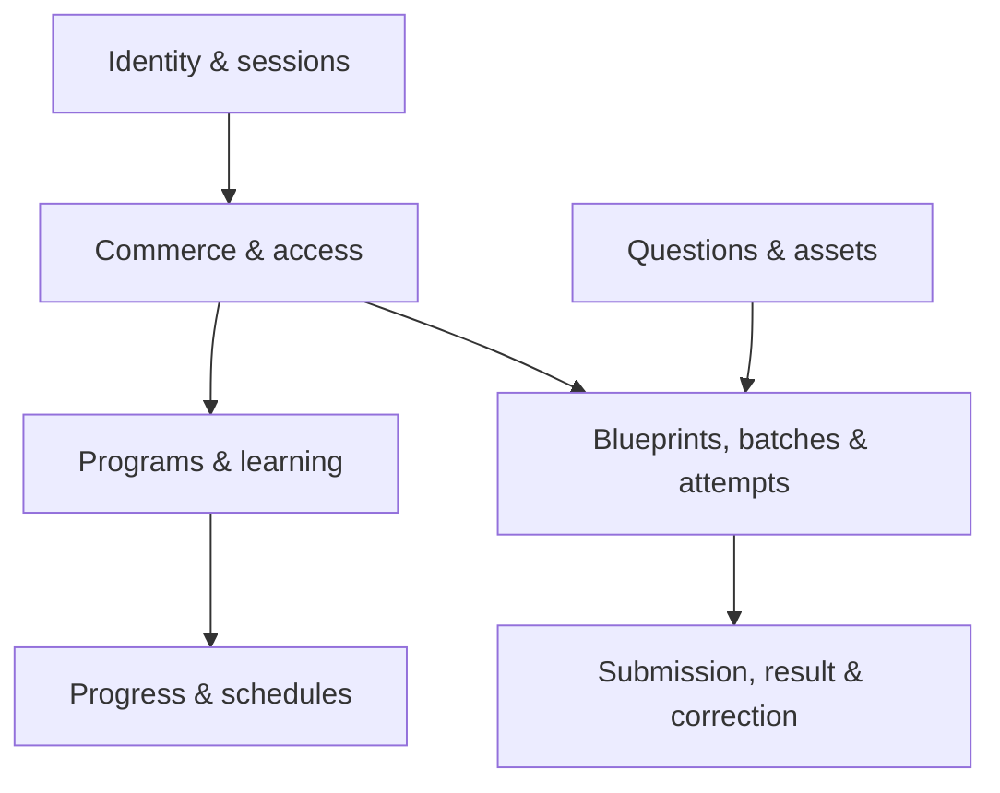
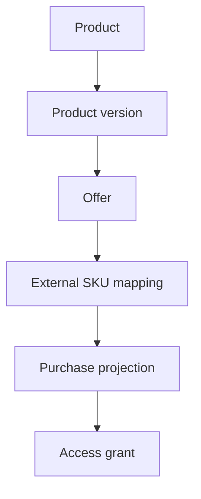
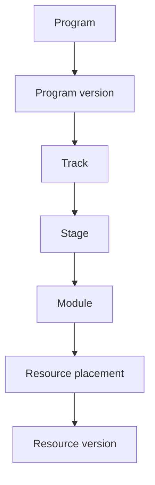
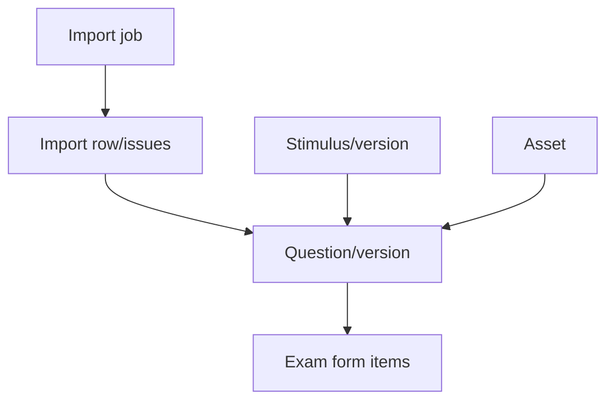
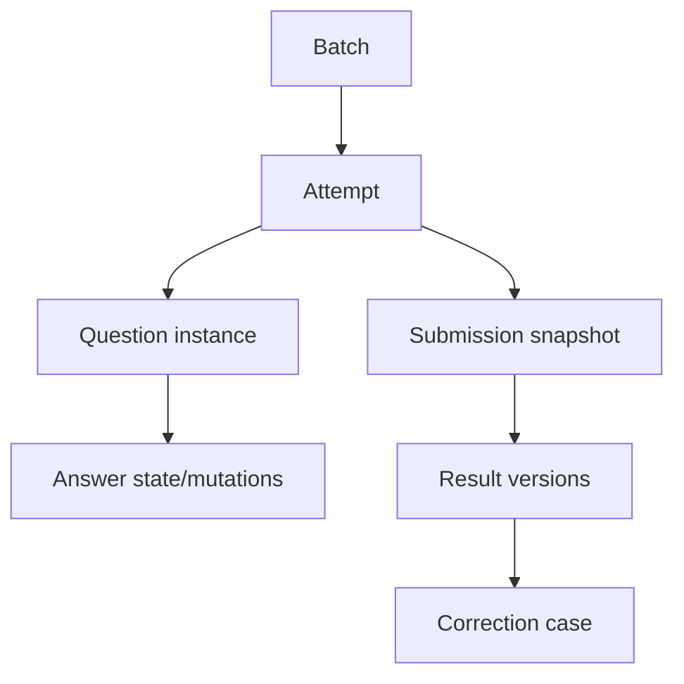

# 21 — ERD dan Data Dictionary

**Versi:** 1.0-RC2  
**Status:** Conceptual/logical contract; physical mapping terselaraskan untuk review implementasi

## 1. Conventions

- Primary key: UUID.
- Time: `timestamptz`, server-generated.
- Money: integer smallest unit + ISO currency.
- Stable business code: text unique and immutable after publish/use.
- Status: constrained text/enum with explicit transitions.
- JSONB: versioned config/snapshot only.
- Soft archive, bukan generic soft-delete pada seluruh table.
- Immutable/versioned records tidak di-update setelah locked kecuali controlled metadata amendment.

## 2. Domain overview

## 3. Identity and authorization

### `users`

App identity.

| Field | Type | Rule |
|---|---|---|
| id | uuid | PK |
| status | text | active, suspended, archived |
| display_name | text | nullable until resolved |
| email_normalized | text | nullable; not sole merge key |
| phone_e164 | text | nullable |
| timezone | text | default Asia/Jakarta |
| created_at/updated_at | timestamptz | server |

Unique email/phone tidak otomatis berarti merge; collision dapat menjadi identity case.

### `external_identities`

| Field | Rule |
|---|---|
| provider + external_subject | unique |
| user_id | FK users |
| provider_payload_ref | redacted reference |
| verified_at | nullable |
| linked_by/reason | provenance |

### `user_sessions`

Session hash, device label, issued/last_seen/expires/revoked, IP/user-agent metadata teredaksi.

### `roles`, `permissions`, `user_roles`, `role_permissions`

RBAC base. Seed role kanonik: `super_admin`, `operations_admin`, `academic_admin`, `tutor_writer`, `moderator_reviewer`, `live_class_coordinator`, `support`, dan `finance_reconciliation`. Object-scope tambahan diterapkan service layer dan assignment table bila diperlukan; separation of duties memakai actor ID.

### `identity_conflicts`

Candidate links/duplicates yang memerlukan review; tidak menyimpan credential.

## 4. Product and commerce

### `products`

Stable commercial identity: code, name, type, status.

### `product_versions`

- product FK;
- version number;
- benefits summary/terms version;
- draft/published/archived;
- locked_at;
- unique product + version.

### `product_components`

Component/grant template:

- product_version;
- target_type/target_id;
- access_policy;
- include_descendants;
- component code;
- validity/attempt overrides.

Target integrity divalidasi service dan publication validator; future physical model dapat memakai typed claim tables jika polymorphic constraint menjadi risiko.

### `offers`

- product_version;
- code/version/title;
- visibility/status;
- list/current amount + currency;
- sale start/end;
- real quota/reservation policy;
- eligibility/upgrade config;
- checkout/return terms.

### `external_sku_mappings`

- provider/site;
- external product/variant ID;
- offer/version;
- valid_from/to;
- mapping priority/status;
- unique provider + site + external SKU + validity rule.

### `checkout_intents`

Opaque correlation, user, offer, overlap snapshot, return path, expiry, resolved purchase.

### `purchases`

- provider/site/external order ID unique;
- user nullable until resolved;
- product/offer/mapping snapshots;
- normalized status;
- amounts/currency;
- ordered/paid/refunded timestamps;
- reconciliation state.

### `purchase_events`

Append-only verified external events: provider event key unique, payload checksum, redacted raw JSON, received/occurred, verification, processing result.

### `reconciliation_cases`

Type, severity, related user/purchase/event, state, evidence, owner, resolution.

## 5. Access

### `access_policies`

Versioned policy:

- actions/capabilities;
- validity mode/config;
- attempt allowance/ranking config;
- include descendants;
- status/version/checksum.

### `access_grants`

- user;
- source_type/source_id;
- policy version;
- status;
- valid_from/to/activated_at;
- parent grant for bundle expansion;
- issued/revoked/suspended actor/reason;
- idempotency/source key.

### `grant_claims`

Typed target claims derived from product component/pass:

- grant;
- target type/id;
- action/capability;
- include descendants;
- limits/config.

### `effective_access`

Rebuildable projection:

- user + target + action unique;
- allowed;
- effective start/end;
- supporting grant IDs/reason summary;
- attempts remaining summary;
- projection version/updated.

Source of truth remains grants/claims/policy.

### `access_change_requests`

Dry-run and approval for manual/large changes; stores requested action, preview, reason, approvals, result.

## 6. Programs and content

### `programs`, `program_versions`

Stable program and immutable published version; onboarding schema and period live on version.

### `tracks`, `roadmap_stages`, `modules`

Owned by program version, ordered, release/prerequisite/completion configs.

### `resources`, `resource_versions`

Stable reusable identity and typed version: content document, asset/provider reference, completion/download policy, accessibility metadata.

### `resource_placements`

Module + resource version + local order/label + required/release/prerequisite.

### `assets`

Stable media inventory:

- owner/scope;
- object keys for original/variants;
- MIME, size, dimensions, checksum;
- scan/processing state;
- alt text/caption;
- visibility/protection;
- provenance.

### `program_enrollments`

User + program/version, onboarding state, primary flag, enrolled/last activity/completed/archive.

Enrollment bukan authorization source.

### `onboarding_responses`

Enrollment + schema version + field key/value JSON + updated; sensitive fields classified.

### `resource_progress`

User/enrollment + placement unique; state, position, started/last/completed, source, resource version.

### `progress_events`

Append log untuk rebuild/debug; idempotency key dan typed payload.

### `progress_projections`

Program/track/stage aggregates, required denominator, updated/version.

## 7. Schedule and live learning

### `schedule_items`

Program/track, type, source object, title, start/end/timezone, visibility, status, revision lineage.

### `live_sessions`

Provider/external meeting reference, tutor, join policy/window, recording policy, current schedule item.

### `live_session_occurrences`

Revision/reschedule/cancel lineage; old occurrence remains.

### `attendances`

User + occurrence, first/last join, source, status. Not authoritative access/progress by default.

### `community_links`

Program/track, provider, gated URL secret reference, instructions, validity.

## 8. Question bank and imports

### `questions`, `question_versions`

Stable code/identity; version includes type, taxonomy, stem document, response schema, scoring secret reference/config, explanation, provenance, status, checksum.

Secret fields require restricted serializer/query path.

### `stimuli`, `stimulus_versions`

Shared passage/document and assets.

### `question_assets`

Question/stimulus version, placement (`stem`, `option`, `explanation`), option key/order, asset, alt metadata.

### `moderation_reviews`

Object/version, reviewer, checklist version, decision, comment, timestamps.

### `question_reports`

Student/admin report, attempt context, category, state, resolution/correction case.

### `question_usage`

Question version + form/batch; ranked/practice and exposure metadata.

### `import_jobs`, `import_rows`, `import_issues`

File references/checksum/template/mode/status/totals; normalized row provenance; field-level issues.

## 9. Exam configuration

### `exam_families`

Stable code, name, activation state.

### `exam_blueprints`, `exam_blueprint_versions`

Stable blueprint; versioned structure/timer/navigation/presentation/result configs, regulatory sources, approvals, checksum.

### `scoring_policies`, `scoring_policy_versions`

Scorer registry/config, thresholds/categories, interpretation, engine compatibility, fixtures/checksum.

### `exam_forms`, `exam_form_versions`

Stable form; version links blueprint/scoring, composition, status, locked/checksum.

### `exam_form_items`

Form version + section + question version + order/pool/group metadata.

### `batches`

Stable code/name, exam form version, timezone, operational state.

### `batch_windows`

Typed window: visibility, registration, attempt, cutoff, provisional result, final result, leaderboard, review, access.

### `attempt_policies`

Batch/product override scope, ranked/practice limits, resume, ranking, late sync, writer lease, accommodation config.

## 10. Attempts and results

### `attempts`

- user/batch/attempt number;
- state;
- blueprint/form/scoring/policy snapshots;
- started/deadline/cutoff/submitted;
- current revision;
- writer lease summary;
- idempotency start key;
- accommodation/incident references.

Unique user + batch + attempt number, bukan user + batch saja.

### `attempt_question_instances`

Attempt + question version + section + presented order + option order JSON. Unique attempt + position/question instance.

### `attempt_writer_leases`

Attempt, session/device, token hash, issued/renewed/expires/revoked/takeover reason.

### `attempt_answers`

Current answer per question instance: typed payload, revision, saved_at, source mutation.

### `answer_mutations`

Append log: client mutation ID unique per attempt, expected/accepted revision, payload, writer lease, received/captured, disposition.

### `attempt_flags`

Current flagged state and revision.

### `submissions`

Attempt unique current finalization, idempotency key, reason user/timeout/admin, answer snapshot/checksum, status.

### `result_versions`

Attempt/submission, version, state, scores JSON, evaluation, scoring engine/policy, input checksum, released/corrected timestamps; one current pointer.

### `ranking_subjects`, `ranking_snapshots`, `ranking_entries`

`ranking_subjects` adalah mapping restricted user↔subject token/alias/privacy preference. Snapshot dan entry hanya menyimpan `ranking_subject_id`, score tuple, tie-break, dan cohort—tidak ada FK user langsung pada immutable entry. Public serializer meresolve alias saat baca dan tidak mengekspos subject token.

### `correction_cases`, `correction_impacts`, `correction_approvals`

Cause, affected versions/attempts, preview, approvals, published result version.

### `exam_incidents`, `attempt_accommodations`

Operational incident and per-attempt controlled changes.

## 11. Notifications and analytics

### `notification_preferences`

User + category/channel, enabled, consent/source, updated.

### `notification_templates`, `notification_template_versions`

Stable code and versioned body/variables/provider mapping.

### `notification_jobs`, `notification_deliveries`

Trigger/audience/template/channel/idempotency/schedule; per-recipient provider status.

### `analytics_events`

Optional first-party buffer: schema name/version, actor pseudonym, context IDs, allowlisted properties, occurred/received/source. Can be forwarded/archived.

## 12. Platform operations

### RC2 physical invariants

- `consent_records` dan guardian state memisahkan bukti consent dari profil.
- Role/permission, notification, reconciliation, moderation, import row, ranking, accommodation, incident, analytics, background job, progress event/projection, dan live occurrence mempunyai tabel fisik.
- `question_version_secrets` memisahkan kunci/bobot dari konten yang dapat diserialisasi ke siswa.
- `attempts` menyimpan FK versi dan snapshot policy; `answer_mutations` menyimpan payload recovery serta writer lease.
- Satu lease aktif dan satu result current per attempt dijamin partial unique index berbasis boolean state, bukan predicate `now()`.
- PII fields diberi klasifikasi pada migration comments/security catalog sebelum production migration dibuat.
- `exam_families.activation_scope` adalah rumah kanonik gate `draft_only|staging|production`.
- Question/stimulus media memakai `question_assets` dengan placement role, `image_purpose`, alt text, dan XOR owner constraint.
- Attendance, community, onboarding response, question usage, correction impact/approval, ranking subject, dan system config mempunyai tabel fisik eksplisit.

### `audit_logs`

Append-oriented actor/action/object/diff/reason/correlation/IP metadata.

### `outbox_events`

Aggregate/event/payload/idempotency, available/processed/attempts/error.

### `background_jobs`

Type, idempotency, payload reference, status, attempts, scheduled/lease/heartbeat/error.

### `system_config_versions`

Versioned safe operational configuration; secrets remain secret manager.

## 13. Key constraints

1. Published product/program/question/blueprint/form/scoring versions are locked.
2. Purchase provider + site + external order unique.
3. Purchase event provider event key unique.
4. Grant source idempotency key unique.
5. Effective access unique by user + target + action.
6. Question code unique; question version unique by question + version.
7. Attempt number unique by user + batch.
8. Answer current unique by attempt + question instance.
9. Mutation ID unique by attempt + client mutation ID.
10. Submission finalization unique by attempt.
11. Result version unique by attempt + version; one current.
12. Outbox/job idempotency keys unique within type/scope.

## 14. Referential deletion policy

- User: suspend/anonymize where deletion conflicts with legal/audit obligations.
- Product/purchase/grant: archive/status transition, never cascade-delete history.
- Program/resource/question versions used historically: restrict deletion.
- Temporary import/export objects: lifecycle delete after retention.
- Session/token: revoke then retention purge.
- Projection/cache: safe to rebuild/delete.

## 15. Sensitive data classification

| Class | Contoh | Control |
|---|---|---|
| Secret | tokens, provider secrets | Secret manager; never DB plain text |
| Exam secret | answer keys, weights | restricted columns/serializer/role |
| PII | email, phone, device/IP | encryption/access/redaction/retention |
| Financial | order/amount/refund | restricted and audited |
| Learning | progress/result | user/admin scope |
| Public-ish | catalogue/published program metadata | cacheable after review |

## 16. Index strategy draft

- status/time composite for jobs/windows.
- user + active status for grants/enrollments/attempts.
- target lookup for grant claims/effective access.
- provider IDs for commerce/identity.
- batch + state for attempts/results.
- import job + row/severity.
- question taxonomy/status/search index.
- audit object/time and actor/time.

Index final mengikuti query plans/load test; jangan membuat semua kombinasi.

## 17. Projection rebuild

Required commands/jobs:

- rebuild effective access for user/source/product;
- rebuild progress for enrollment/program;
- rebuild next action;
- rebuild leaderboard for batch/result version;
- reprocess purchase event safely.

Rebuild memiliki dry-run/count/checksum dan audit untuk manual invocation.

## 18. Physical schema caveat

`contracts/drizzle-schema.ts` adalah executable starting contract, bukan migration siap produksi. Sebelum migration pertama:

- validate enum/status transitions;
- resolve polymorphic target integrity;
- review PII encryption/search strategy;
- run migration generation/check;
- load test attempt/answer indexes;
- confirm provider payload identifiers.

### Mapping logical ke physical RC2

| Logical contract | Physical RC2 | Disposisi |
|---|---|---|
| `program_enrollments` | `enrollments` | Nama dipendekkan; constraint user+program tetap kanonik. |
| `resource_progress` | `progress_records` | Nama fisik; experienced resource version dipisahkan. |
| `import_jobs/rows/issues` | `question_imports/question_import_rows/question_import_issues` | Nama domain-spesifik. |
| `result_versions` | `results` | Setiap row tetap versioned; satu current pointer ditegakkan index. |
| `correction_cases` | `result_corrections` | Nama fisik; child `correction_impacts` dan `correction_approvals` eksplisit. |
| `exam_blueprints` + `exam_blueprint_versions` | `exam_blueprints` | Deliberate collapsed mapping untuk MVP: stable `code` + immutable `version`, unique `(code, version)`; parent table terpisah ditunda sampai ada metadata stable yang tidak cocok pada row version. |
| `scoring_policies` + `scoring_policy_versions` | `scoring_policies` | Deliberate collapsed mapping dengan aturan code/version sama. |
| `exam_forms` + `exam_form_versions` | `exam_forms` | Deliberate collapsed mapping dengan aturan code/version sama. |
| `attendances`, `community_links`, `onboarding_responses` | Tabel senama | Dipetakan langsung. |
| `question_assets`, `question_usage`, `exam_families` | Tabel senama | Dipetakan langsung dan menjadi publication input. |
| `system_config_versions`, `correction_impacts`, `correction_approvals` | Tabel senama | Dipetakan langsung. |

Collapsed mapping bukan izin mutasi row published. Jika kebutuhan stable-parent muncul, migration expand/backfill/switch wajib mempertahankan ID/checksum historis.
