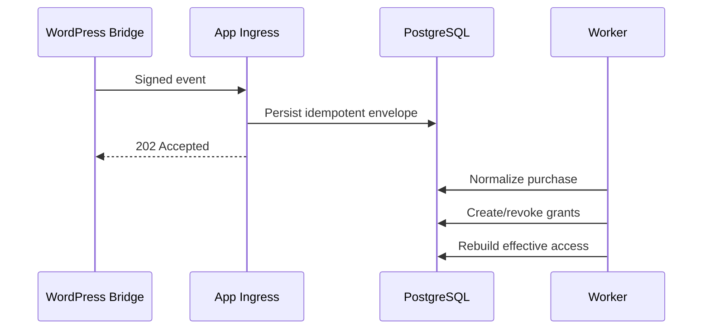

# 23 — Sejoli dan WordPress Integration

**Versi:** 1.0-RC2  
**Status:** Architecture contract with mandatory staging spike  
**MVP posture:** WordPress/Sejoli tetap commerce source; web app menjadi student experience

## 1. Scope boundary

### Tetap di WordPress/Sejoli

- Marketing pages, blog, SEO.
- Checkout dan payment gateway.
- Order, coupon, affiliate, commission.
- Refund operation dan finance reporting.
- Existing campaign/landing integrations.

### Pindah ke web app

- Catalogue projection dan ownership state.
- Program/LMS/live class/recording.
- Tryout and results.
- Effective access and explanation.
- Student/admin learning dashboard.

### Bridge

- Identity exchange/linking.
- Product/SKU mapping.
- Order/payment/refund events.
- Reconciliation read/export.
- Post-payment return.

## 2. Critical unknowns

Dokumentasi publik Sejoli belum cukup untuk membekukan:

- event hook yang tepat untuk order/status/refund;
- signature or shared-secret mechanism;
- stable customer/product/variant identifiers;
- retry and duplicate semantics;
- interaction antara Sejoli dan WooCommerce bila keduanya terpasang;
- SSO/token exchange capability.

Karena itu, nama hook dan payload final hanya boleh ditetapkan setelah staging capture.

Official references awal:

- https://docs.sejoli.co.id/
- https://developer.woocommerce.com/docs/best-practices/urls-and-routing/webhooks/

## 3. Recommended bridge architecture

Plugin minimal `superlatif-app-bridge` pada WordPress:

- menerbitkan signed one-time login code;
- menangkap canonical order lifecycle dari hook yang terbukti;
- membentuk envelope versioned;
- menandatangani dan mengirim event ke app;
- menyimpan delivery log/status terbatas;
- menyediakan admin diagnostics/replay terkontrol;
- tidak menghitung entitlement di WordPress.

Jika Sejoli native API/webhook memenuhi semua kebutuhan, plugin tetap dapat menjadi normalization/signing layer tipis.

## 4. Identity model

### Identifiers

- `app_user_id`: internal stable identity.
- `wordpress_user_id`: external subject.
- `sejoli_customer/member_id`: bila tersedia dan stabil.
- email/phone: attributes, bukan sole identity key.

### Link rules

1. Existing verified external identity maps directly.
2. New external subject + unique verified account creates/link per policy.
3. Email/phone collision creates conflict case.
4. Support merge requires evidence, elevated permission, preview, audit.
5. External user deletion/suspension does not silently delete app history.

## 5. SSO/bridge login protocol draft

1. WordPress authenticates user by existing mechanism.
2. Bridge creates authorization code record: random ID, subject, audience, return path allowlist, issued/expiry, nonce, used state.
3. Browser redirects to app with opaque code.
4. App backend exchanges/verifies code with signature or server endpoint.
5. Code marked used atomically.
6. App resolves external identity and creates session.
7. Browser redirected to allowlisted destination.

Properties:

- expiry 1–5 minutes provisional;
- one-time/replay resistant;
- audience and environment bound;
- no email/PII in query string;
- redirect allowlist;
- key rotation support.

## 6. Product mapping

`external_sku_mappings` supports:

- provider/site;
- external product and variant/price ID;
- internal offer version;
- valid_from/to;
- status and priority;
- migration note.

Many external SKUs can map to one offer/product. Mapping used by an order is snapshotted.

Admin safeguards:

- prevent overlapping active mapping for same provider/site/SKU unless priority rule explicit;
- test payload mapping;
- preview generated grants;
- mapping change affects future events only unless replay/reconciliation approved.

## 7. Event envelope

Bridge sends:

- envelope version;
- event ID/type/occurred time;
- site/environment;
- external order/customer/SKU IDs;
- normalized status candidate;
- amount/currency;
- relevant line items;
- source revision/update time;
- payload checksum;
- signature metadata.

Raw provider payload is minimized/redacted. Secret/payment credential never sent.

## 8. Verification

Preferred order:

1. HMAC signature over raw canonical bytes with timestamp/key ID.
2. Replay window and event ID dedupe.
3. TLS mandatory.
4. IP allowlist supplemental only.
5. Mutual TLS optional if operationally justified.

Signature secret stored separately per environment and rotatable with overlapping key IDs.

## 9. Event processing

Notification occurs after committed access state.

## 10. Normalized purchase states

- pending;
- paid;
- failed;
- expired;
- cancelled;
- refunded_partial only if source semantics and refunded amount are valid;
- refunded_full;
- chargeback if available.

Provider state map is configuration/versioned adapter, not scattered switch statements.

## 11. Transition behavior

### Paid

- resolve identity and mapping;
- upsert purchase snapshot;
- create source grant tree;
- project access;
- resolve checkout intent;
- notify.

### Refund/cancel

- update purchase projection;
- revoke/cancel only grants from that purchase;
- preserve other grants;
- compute affected capabilities;
- notify/support case if active attempt conflict.

### Out-of-order

- compare provider revision/occurred time and allowed transition;
- do not regress paid to pending;
- preserve all events;
- create reconciliation when ambiguous.

## 12. Reconciliation

### Scheduled checks

- paid purchase without active grant;
- active purchase grant without supporting purchase;
- unknown SKU;
- unresolved user;
- duplicate orders;
- refund mismatch;
- stale pending/provisioning;
- projection checksum mismatch.

### Read source

Preferred: authenticated API/export from source. Jika tidak tersedia, bridge menyediakan constrained admin/export endpoint atau scheduled signed snapshot.

Reconciliation does not mutate source finance records.

## 13. Checkout handoff

- App creates checkout intent.
- Existing access and upgrade eligibility checked.
- Redirect uses configured Sejoli checkout URL with safe prefill only where supported.
- Return path points to purchase status, not directly claiming success.
- User sees pending/provisioning/active based on verified projection.

No order status is trusted from query parameter.

## 14. Existing user migration

Sources:

- WordPress users;
- Sejoli members/orders/subscriptions;
- legacy entitlements/products;
- active program roster.

Process:

1. Export snapshot with stable IDs.
2. Normalize and deduplicate candidates.
3. Import external identities.
4. Map products/orders.
5. Generate migration grants with provenance.
6. Compare expected active roster.
7. Pilot cohort, then batches.

Do not migrate all dormant accounts before active access is proven.

## 15. Failure and retry

- Bridge retries timeout/5xx with exponential backoff and same event ID.
- 4xx verification/schema errors stop and surface admin diagnostic.
- App returns quickly after durable receipt.
- Replay from bridge/admin keeps original event ID or creates replay reference; does not duplicate domain effect.
- Dead delivery monitored.

## 16. Operational dashboards

Bridge/WordPress:

- recent delivery status;
- last success/failure;
- event type/order reference;
- safe retry;
- key/environment status.

App:

- ingest/processing lag;
- verification failures;
- unknown mapping/user;
- purchase-to-access latency;
- reconciliation backlog.

## 17. Security/privacy

- Least payload necessary.
- Secrets never in WordPress options unencrypted if better secret storage is available; at minimum restrict/autoload off and rotate.
- Admin capability required for diagnostics/replay.
- PII redacted in logs.
- Bridge endpoint rate limited.
- Plugin update/code review process.
- WordPress compromise considered trust-boundary risk; anomaly/reconciliation remains.

## 18. Spike test plan

1. Create staging products: bundle, single batch, upgrade.
2. Create users/orders with `pending`, `paid`, `expired`, `cancelled`, `refunded_partial`, `refunded_full`, dan `chargeback` states.
3. Capture hooks/events and identifiers.
4. Test duplicate and out-of-order replay.
5. Test user email change.
6. Test refund with overlapping scholarship grant.
7. Test login token replay/redirect attack.
8. Measure event-to-access latency.
9. Document final payload/schema/signing in ADR.

## 19. Acceptance

- Paid order provisions correct program/batch once.
- Refund affects only source grant.
- Multiple SKUs map correctly to one internal offer.
- Login does not require second registration and rejects replay.
- Unknown SKU/user enters queue with recoverable workflow.
- Return URL never activates access by itself.
- Reconciliation finds deliberately injected mismatch.

## 20. Open decisions

### Audit resolution RC2

Setiap purchase menyimpan `external_sku_mapping_id/version`, offer/product version, gross, discount, net settled, refunded amount, currency, serta payload checksum. Meskipun canonical envelope sudah ditulis, OD-01 dan OD-02 tetap hard gate: implementasi signature, retry, event coverage, stable IDs, return reference, prefill, coupon/affiliate amount, dan SSO bridge harus dibuktikan menggunakan staging/provider nyata sebelum jalur commerce diaktifkan.

- Whether Sejoli runs independently or with WooCommerce in current installation.
- Final hook/API and signing support.
- Stable Sejoli customer/variant identifiers.
- Refund/partial refund semantics.
- Prefill and post-payment return capabilities.
